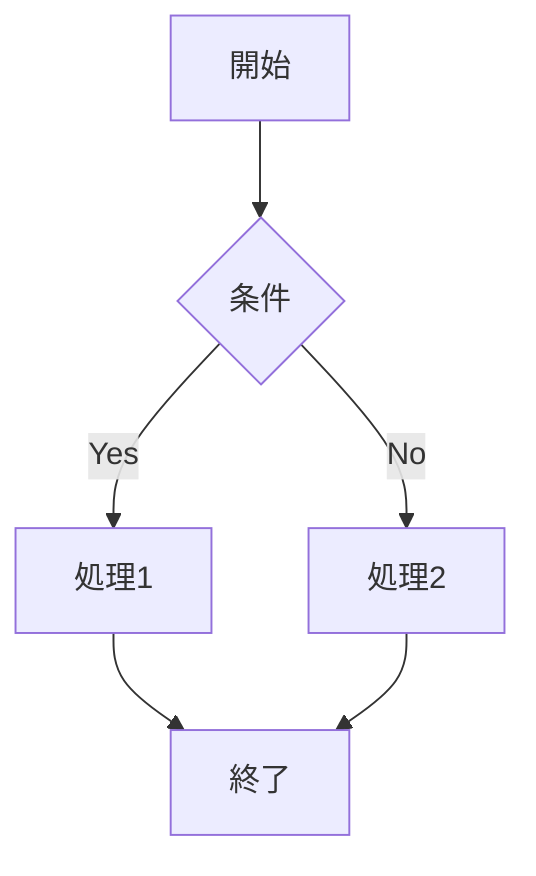
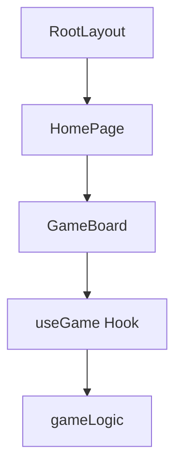
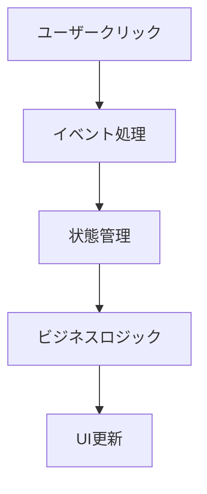
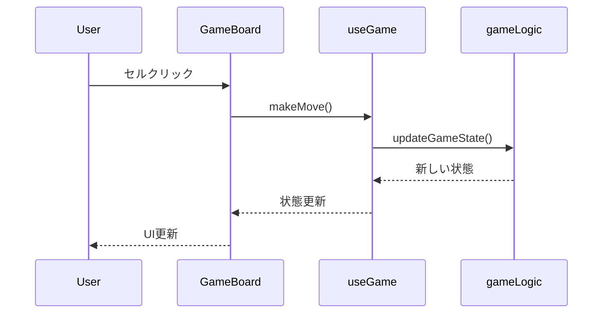
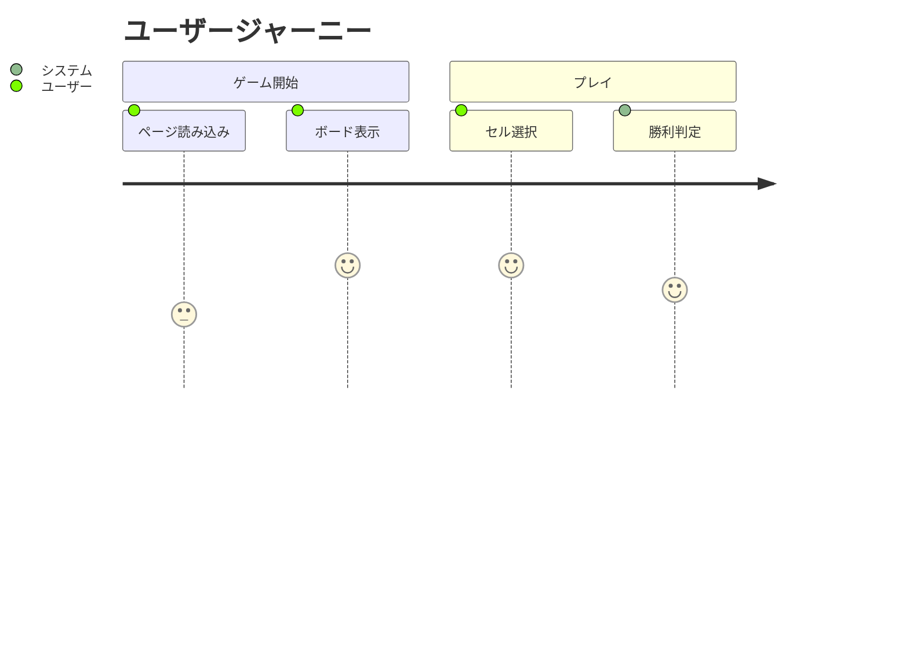

# 3x3三目並べアプリケーション - 詳細コード解説書

## 📖 はじめに（React/Next.js初心者向け）

この解説書は、React や Next.js を初めて学ぶ方を対象に、実際に動作する本格的な3x3三目並べアプリケーションのコードを詳しく解説します。単なるコード紹介ではなく、「なぜこの技術を選んだのか」「どのようにコンポーネントが連携しているのか」を理解できるよう、基礎から丁寧に説明していきます。

## 🎯 プロジェクト概要

### 何ができるアプリケーション？

このアプリは、シンプルな三目並べゲームを超えた高機能なWebアプリケーションです：

- **基本ゲーム機能**: 3x3ボードでの三目並べ（勝利・引き分け判定付き）
- **2つの対戦モード**: 人vs人、人vsコンピュータ（AI搭載）
- **先攻・後攻選択**: X/O任意選択可能
- **棋譜システム**: ゲームの記録・履歴表示・詳細な再生機能
- **統計機能**: 勝敗記録・ゲーム数カウント
- **モダンUI**: ダークモード・レスポンシブデザイン・アニメーション

### なぜこの技術を選んだのか？

**Next.js を選んだ理由**:
- React の学習にベストな環境（設定が簡単）
- サーバーサイドレンダリング対応（高速表示）
- ファイルベースルーティング（直感的なページ管理）
- 将来的なWebアプリ開発に必須の技術

**TypeScript を選んだ理由**:
- 型安全性によるバグの事前発見
- IDE でのコード補完・エラー検出
- 大規模開発での保守性向上
- 現代のWeb開発スタンダード

## 🏗️ プロジェクト構造の詳細解説

### ディレクトリごとの役割

```
proj002_3x3/
├── src/                    # 全ソースコード
│   ├── app/               # Next.js ページ（ブラウザで表示される部分）
│   ├── components/        # 再利用可能なUIパーツ
│   ├── hooks/            # ロジック処理（カスタムフック）
│   ├── lib/              # ビジネスロジック（ゲームのルール等）
│   └── types/            # TypeScript型定義
├── docs/                 # 設計資料・図表
│   ├── architecture/     # アーキテクチャ図（Mermaid記法）
│   └── ux/              # UXフロー図（Mermaid記法）
├── public/               # 静的ファイル（画像・アイコン等）
├── package.json          # プロジェクト設定・依存関係
└── 設定ファイル群         # TypeScript・ESLint・Tailwind設定
```

## 📊 視覚的設計資料の活用

このプロジェクトには、コードの理解を深めるための **Mermaid記法** で書かれた設計資料が豊富に含まれています。これらの図表は、コードの構造や動作フローを視覚的に理解するのに役立ちます。

### 📂 設計資料の構成

```
docs/
├── architecture/          # システム設計図
│   ├── component-diagram.md    # コンポーネント関係図
│   ├── data-flow.md           # データフロー図
│   ├── sequence-diagram.md    # シーケンス図
│   ├── system-architecture.md # システム構成図
│   └── type-diagram.md        # 型定義関係図
└── ux/
    └── user-flow.md          # ユーザーフロー図
```

### 🔍 Mermaidとは？

**Mermaid** は、テキストベースで図表を作成できる記法です。コードのように書くことで、フローチャートやシーケンス図などを簡単に作成できます。

**基本的な読み方**:


**記号の意味**:
- `[]`: 四角い箱（処理・状態）
- `{}`: ダイヤモンド（条件分岐）
- `-->`: 矢印（フローの方向）
- `|テキスト|`: 矢印のラベル

## 📱 アプリケーションの画面構成

### 1. メインページ (`src/app/page.tsx`)

**ファイルの役割**: アプリケーションのトップページ  
**URL**: `http://localhost:3000/`

```typescript
"use client";

import React, { useState } from "react";
import { GameBoard } from "../components/GameBoard";
import { useGameHistory } from "../hooks/useGameHistory";
```

**コード解説**:

- **`"use client"`**: Next.js App Router で、このコンポーネントがブラウザ側で実行されることを指定
- **`useState`**: React の状態管理フック（統計表示のON/OFF切り替えに使用）
- **`GameBoard`**: ゲーム画面を表示するコンポーネント
- **`useGameHistory`**: 棋譜履歴を管理するカスタムフック

### 2. 棋譜履歴ページ (`src/app/history/page.tsx`)

**ファイルの役割**: 過去のゲーム記録一覧表示  
**URL**: `http://localhost:3000/history`

### 3. 棋譜再生ページ (`src/app/replay/[id]/page.tsx`)

**ファイルの役割**: 特定のゲームの手順を再生  
**URL**: `http://localhost:3000/replay/game-123456789`

**動的ルーティング**:
- `[id]` フォルダ名 → URL パラメータとして自動処理
- 例: `replay/game-123` の `game-123` が `id` として取得可能

## 🧩 コンポーネント設計の詳細

### GameBoard コンポーネント (`src/components/GameBoard.tsx`)

**役割**: ゲーム画面の中心となるコンポーネント

```typescript
export function GameBoard({
  config,
  onGameEnd,
  disabled = false,
}: GameBoardProps) {
  const {
    gameState,
    makeMove,
    resetGame,
    gameMode,
    setGameMode,
    isAITurn,
  } = useGame(config, onGameEnd);
```

**重要ポイント**:

1. **Props による設定**: 親コンポーネントから設定を受け取る
2. **カスタムフック使用**: `useGame` でゲームロジックを分離
3. **状態の分離**: UIと実際のゲームロジックを分けて管理

### Button コンポーネント (`src/components/Button.tsx`)

**役割**: アプリ全体で統一されたボタンデザイン

```typescript
interface ButtonProps {
  variant?: "primary" | "secondary" | "danger";
  size?: "sm" | "md" | "lg";
  onClick?: () => void;
  disabled?: boolean;
  children: React.ReactNode;
}
```

**設計思想**:
- **バリアント設計**: 用途別にデザインパターンを用意
- **再利用性**: 1つのコンポーネントで複数の見た目に対応
- **TypeScript**: Props の型を明確に定義

### Cell コンポーネント (`src/components/Cell.tsx`)

**役割**: 3x3ボードの各セル（マス目）

```typescript
interface CellProps {
  position: BoardPosition;
  content: "X" | "O" | null;
  onClick: (position: BoardPosition) => void;
  disabled?: boolean;
}
```

**特徴**:
- **アクセシビリティ対応**: スクリーンリーダー・キーボード操作対応
- **視覚的フィードバック**: ホバー効果・クリック時アニメーション
- **状態管理**: 空・X・Oの状態を適切に表示

## 🎣 フック（Hooks）の詳細解説

### useGame フック (`src/hooks/useGame.ts`)

**役割**: ゲーム全体の状態とロジックを管理

```typescript
export function useGame(
  config?: Partial<GameConfig>,
  onGameEnd?: (gameRecord: GameRecord) => void
): UseGameReturn {
  const [gameState, setGameState] = useState<GameState>(() =>
    createInitialGameState(initialPlayer)
  );
```

**重要な概念**:

1. **状態管理**: `useState` でゲームの現在状態を保持
2. **副作用処理**: `useEffect` でAIの自動実行・ゲーム終了検知
3. **メモ化**: `useCallback` で関数の不要な再作成を防止
4. **カスタムフック**: 複雑なロジックをコンポーネントから分離

**AIターンの実装**:
```typescript
useEffect(() => {
  if (isAITurn) {
    const timer = setTimeout(() => {
      const aiMove = getAIMove(gameState.board, aiPlayer);
      setGameState(prevState => processMove(prevState, aiMove));
    }, 500); // 0.5秒待ってからAIが手を打つ
    
    return () => clearTimeout(timer);
  }
}, [isAITurn]);
```

### useGameHistory フック (`src/hooks/useGameHistory.ts`)

**役割**: 棋譜の保存・読み込み・削除を管理

```typescript
export function useGameHistory() {
  const [games, setGames] = useState<GameRecord[]>([]);
  const repository = useMemo(() => new LocalStorageRepository(), []);
```

**データ永続化の仕組み**:
- **localStorage**: ブラウザにデータを保存（リロードしても残る）
- **Repository パターン**: データアクセス方法を抽象化
- **型安全性**: TypeScript で保存データの形式を保証

### useGameReplay フック (`src/hooks/useGameReplay.ts`)

**役割**: 棋譜再生機能の制御

```typescript
export function useGameReplay(gameRecord: GameRecord) {
  const [currentMoveIndex, setCurrentMoveIndex] = useState(0);
  const [isPlaying, setIsPlaying] = useState(false);
  const [playbackSpeed, setPlaybackSpeed] = useState(1);
```

**再生機能の実装**:
- **タイマー制御**: 一定間隔で手順を進める
- **速度調整**: 0.5倍～2倍速での再生対応
- **手動制御**: 再生・一時停止・前後への移動

## 🔧 ビジネスロジック層の解説

### gameLogic.ts (`src/lib/gameLogic.ts`)

**役割**: ゲームのルール・判定ロジック

```typescript
export function checkWinner(board: Board): Player | null {
  const winPatterns = [
    [0, 1, 2], [3, 4, 5], [6, 7, 8], // 横
    [0, 3, 6], [1, 4, 7], [2, 5, 8], // 縦
    [0, 4, 8], [2, 4, 6],           // 斜め
  ];
  
  for (const pattern of winPatterns) {
    const [a, b, c] = pattern;
    if (board[a] && board[a] === board[b] && board[a] === board[c]) {
      return board[a];
    }
  }
  
  return null;
}
```

**設計の特徴**:
- **純粋関数**: 入力が同じなら出力も同じ（テストしやすい）
- **副作用なし**: 元のデータを変更せず、新しいデータを返す
- **単体テスト**: ロジックだけを独立してテスト可能

### aiPlayer.ts (`src/lib/aiPlayer.ts`)

**役割**: コンピュータの思考処理

```typescript
export function getAIMove(
  board: Board,
  aiPlayer: Player,
  difficulty: "easy" = "easy"
): BoardPosition {
  const availableMoves = getAvailableMoves(board);
  
  if (availableMoves.length === 0) {
    throw new Error("No available moves");
  }
  
  // 現在はランダム選択（簡単レベル）
  const randomIndex = Math.floor(Math.random() * availableMoves.length);
  return availableMoves[randomIndex];
}
```

**拡張可能な設計**:
- 難易度パラメータで将来的な強化AI対応
- ミニマックス法などの高度なアルゴリズム実装準備済み

### repository.ts (`src/lib/repository.ts`)

**役割**: データ保存・読み込み処理

```typescript
export class LocalStorageRepository implements GameRepository {
  private readonly STORAGE_KEY = "tic-tac-toe-games";

  async saveGame(game: GameRecord): Promise<void> {
    const games = await this.loadGames();
    games.push(game);
    localStorage.setItem(this.STORAGE_KEY, JSON.stringify(games));
  }
}
```

**Repository パターンの利点**:
- **抽象化**: データ保存方法を隠蔽
- **テスト容易性**: モックデータでのテスト可能
- **将来対応**: Firebase等のクラウドDBへの移行が簡単

## 📋 型定義システムの詳細

### 階層化された型管理

```
src/types/
├── common/           # クライアント・サーバー共通型
│   ├── game.ts      # ゲーム関連の基本型
│   ├── api.ts       # API通信用型
│   └── repository.ts # データアクセス型
├── client/          # フロントエンド専用型
│   ├── components.ts # コンポーネントProps型
│   └── hooks.ts     # カスタムフック型
└── game.ts          # レガシー互換型
```

### 重要な型定義

```typescript
// ゲーム状態の型
interface GameState {
  board: (null | "X" | "O")[];
  currentPlayer: "X" | "O";
  gameStatus: "playing" | "finished" | "draw";
  winner: null | "X" | "O";
  moves: Move[];
  firstPlayer: "X" | "O";
}

// 手の記録型
interface Move {
  player: "X" | "O";
  position: number;
  timestamp: number;
}

// ゲーム記録型
interface GameRecord {
  id: string;
  timestamp: number;
  gameMode: "pvp" | "pvc";
  moves: Move[];
  result: "X" | "O" | "draw";
  duration: number;
  playerXStarts: boolean;
}
```

## 🧪 テストシステムの理解

### テストファイルの構成

```
src/
├── components/__tests__/
│   └── GameBoard.test.tsx
├── hooks/__tests__/
│   ├── useGame.test.ts
│   └── useGameHistory.test.ts
└── lib/__tests__/
    ├── gameLogic.test.ts
    ├── aiPlayer.test.ts
    └── repository.test.ts
```

### テストの例

```typescript
// useGame フックのテスト例
describe("useGame", () => {
  test("初期状態が正しく設定される", () => {
    const { result } = renderHook(() => useGame());
    
    expect(result.current.gameState.currentPlayer).toBe("X");
    expect(result.current.gameState.gameStatus).toBe("playing");
    expect(result.current.gameState.board).toEqual(Array(9).fill(null));
  });

  test("手を打つと状態が更新される", () => {
    const { result } = renderHook(() => useGame());
    
    act(() => {
      result.current.makeMove(0);
    });
    
    expect(result.current.gameState.board[0]).toBe("X");
    expect(result.current.gameState.currentPlayer).toBe("O");
  });
});
```

## 🎨 スタイリング（Tailwind CSS）の活用

### ユーティリティクラスの活用

```typescript
// ゲームボードのスタイリング例
<div className="grid grid-cols-3 gap-1 p-4 bg-gray-200 dark:bg-gray-800 rounded-lg shadow-lg">
  {/* セル表示 */}
</div>
```

**Tailwind の利点**:
- **高速開発**: CSSを書かずにスタイリング
- **一貫性**: デザインシステムに沿った統一感
- **レスポンシブ**: 画面サイズ対応が簡単
- **ダークモード**: `dark:` プレフィックスで自動対応

### レスポンシブデザインの実装

```typescript
// 画面サイズ別のスタイリング
<div className="w-full max-w-md mx-auto px-4 sm:px-6 lg:px-8">
  {/* モバイル・タブレット・デスクトップ対応 */}
</div>
```

## 🔄 データフローの理解

### 1. ユーザーアクション → 状態更新

```
ユーザーがセルクリック
    ↓
Cell.onClick → GameBoard.handleCellClick
    ↓
useGame.makeMove → gameLogic.updateGameState
    ↓
useState.setGameState → 画面再レンダリング
```

### 2. ゲーム終了 → 棋譜記録

```
ゲーム終了検知（useEffect）
    ↓
useGame.handleGameEnd → GameRecord作成
    ↓
onGameEnd コールバック → useGameHistory.saveGame
    ↓
LocalStorageRepository.saveGame → localStorage保存
```

### 3. AI思考 → 自動実行

```
isAITurn = true （状態変化）
    ↓
useEffect トリガー → setTimeout（0.5秒待機）
    ↓
aiPlayer.getAIMove → ランダム手選択
    ↓
useGame.processMove → 状態更新 → 画面更新
```

## 📊 設計資料の活用方法

### 🔍 コンポーネント関係図の読み方 (`docs/architecture/component-diagram.md`)

この図では、React コンポーネントの依存関係を視覚化しています：



**読み方のポイント**:
- 矢印の向きが依存関係を示す
- 上位から下位への階層構造が分かる
- 各ボックスの色分けで役割が区別されている

### 🌊 データフロー図の理解 (`docs/architecture/data-flow.md`)

ユーザーアクションから状態更新までの流れを詳細に説明：



**活用方法**:
- バグが発生した際の調査ルート確認
- 新機能追加時の影響範囲把握
- パフォーマンス最適化ポイントの特定

### ⏱️ シーケンス図の活用 (`docs/architecture/sequence-diagram.md`)

時系列でのコンポーネント間の相互作用を示します：



**読み方**:
- 縦線が各コンポーネントのライフライン
- 横矢印が関数呼び出しやデータ受け渡し
- 時間は上から下に流れる

### 🎯 ユーザーフロー図の理解 (`docs/ux/user-flow.md`)

ユーザー体験の全体像を把握できます：



**活用ポイント**:
- ユーザー体験の満足度を数値で確認
- 改善すべきステップの特定
- 新機能がUXに与える影響の予測

## 🛠️ 開発環境とツール

### package.json の重要スクリプト

```json
{
  "scripts": {
    "dev": "next dev --turbopack",     // 開発サーバー（高速）
    "build": "next build",             // 本番用ビルド
    "lint": "next lint",               // コード品質チェック
    "test": "jest",                    // テスト実行
    "test:coverage": "jest --coverage"  // カバレッジ測定
  }
}
```

### 主要な依存関係

```json
{
  "dependencies": {
    "next": "15.3.4",      // Next.js フレームワーク
    "react": "^19.0.0",    // React ライブラリ
    "react-dom": "^19.0.0" // React DOM操作
  },
  "devDependencies": {
    "typescript": "^5",           // TypeScript
    "tailwindcss": "^4",          // CSS フレームワーク
    "jest": "^30.0.3",           // テストフレームワーク
    "@testing-library/react": "^16.3.0" // React テスト
  }
}
```

## 🚀 実際の開発フロー

### 1. 機能追加の手順

1. **設計資料確認**: `docs/` フォルダの図表で影響範囲を把握
2. **型定義**: `src/types/` に必要な型を追加
3. **ロジック実装**: `src/lib/` にビジネスロジック作成
4. **フック作成**: `src/hooks/` に状態管理ロジック
5. **コンポーネント**: `src/components/` にUI作成
6. **ページ統合**: `src/app/` でページに組み込み
7. **テスト作成**: 各 `__tests__/` フォルダにテスト追加
8. **設計資料更新**: 変更内容を図表に反映

### 2. バグ修正の流れ

1. **問題の特定**: テストまたは手動で再現
2. **フロー確認**: シーケンス図・データフロー図で処理追跡
3. **原因調査**: React DevTools・console.log活用
4. **修正実装**: 該当フック・コンポーネント修正
5. **テスト**: `npm test` でリグレッション確認
6. **動作確認**: `npm run dev` で実際の動作チェック
7. **資料更新**: 修正内容を設計資料に反映

## 💡 学習ポイント

### React 初心者が理解すべき概念

1. **コンポーネント**: UIの部品化（再利用可能性）
2. **Props**: 親→子へのデータ受け渡し
3. **State**: コンポーネント内の動的データ
4. **useEffect**: 副作用（API通信・タイマー等）の処理
5. **カスタムフック**: ロジックの再利用とコンポーネントの簡潔化

### Next.js で覚えるべき機能

1. **App Router**: ファイルベースのルーティング
2. **"use client"**: クライアントサイドコンポーネント指定
3. **動的ルーティング**: `[id]` フォルダでのパラメータ処理
4. **レイアウト**: `layout.tsx` での共通UI管理

### TypeScript の活用方法

1. **型注釈**: 変数・関数の型明示
2. **インターフェース**: オブジェクトの型定義
3. **ジェネリクス**: 型の汎用化
4. **型推論**: 自動的な型判定の活用

### Mermaid図表の読み方

1. **フローチャート**: 処理の流れと条件分岐
2. **シーケンス図**: 時系列でのコンポーネント連携
3. **クラス図**: データ構造と関係性
4. **ジャーニーマップ**: ユーザー体験の可視化

## 🔮 将来の拡張可能性

### 1. AI強化

```typescript
// 現在: ランダム選択
export function getAIMove(board: Board, aiPlayer: Player, difficulty = "easy") {
  // 将来: ミニマックス法・機械学習対応
  switch (difficulty) {
    case "easy": return getRandomMove(board);
    case "medium": return getMinimaxMove(board, 3);  // 3手先読み
    case "hard": return getMLMove(board);            // 機械学習
  }
}
```

### 2. クラウド対応

```typescript
// 現在: localStorage
class LocalStorageRepository implements GameRepository {
  // 将来: Firebase/Supabase対応
}

class FirebaseRepository implements GameRepository {
  async saveGame(game: GameRecord): Promise<void> {
    await db.collection("games").add(game);
  }
}
```

### 3. マルチプレイヤー

```typescript
// WebSocket/Socket.io での リアルタイム対戦
class MultiplayerGameHook {
  // オンライン対戦・観戦機能
}
```

## 🎯 設計資料を使った学習のすすめ

### 初心者におすすめの学習順序

1. **ユーザーフロー図** (`docs/ux/user-flow.md`)
   - アプリ全体の流れを把握
   - ユーザー視点での理解

2. **コンポーネント関係図** (`docs/architecture/component-diagram.md`)
   - React コンポーネントの階層構造
   - 依存関係の理解

3. **シーケンス図** (`docs/architecture/sequence-diagram.md`)
   - 具体的な処理の流れ
   - 関数呼び出しの順序

4. **データフロー図** (`docs/architecture/data-flow.md`)
   - 状態管理の仕組み
   - データの流れる方向

### 図表と実際のコードの対応を確認

**例: セルクリック処理**

1. **シーケンス図で流れを確認**
   ```
   User → GameBoard → useGame → gameLogic
   ```

2. **実際のコードを追跡**
   ```typescript
   // GameBoard.tsx
   const handleCellClick = (position) => {
     makeMove(position); // useGame フックの関数
   };
   
   // useGame.ts
   const makeMove = (position) => {
     setGameState(prevState => 
       updateGameState(prevState, position) // gameLogic の関数
     );
   };
   ```

3. **データフロー図で状態変化を確認**
   - 状態更新 → UI再レンダリング → ユーザーへの反映

## 📝 まとめ

このプロジェクトは、**シンプルな三目並べゲーム**を通じて、**モダンなWebアプリケーション開発**の全体像を学べる優秀な教材です。

### 学習できる技術・概念

- **React/Next.js**: モダンフロントエンド開発
- **TypeScript**: 型安全なJavaScript開発
- **コンポーネント設計**: 再利用可能な部品化
- **状態管理**: Hooks を使った効率的な状態制御
- **テスト駆動開発**: Jest/Testing Library での品質保証
- **レスポンシブ UI**: Tailwind CSS でのモダンデザイン
- **設計文書**: Mermaid での視覚的設計表現

### プロジェクトの価値

- **実用性**: 実際に遊べる完成したアプリケーション
- **教育性**: 段階的に学習できる構造
- **視覚性**: 豊富な設計図表による理解促進
- **拡張性**: 将来的な機能追加に対応した設計
- **品質**: 113テスト全PASS の高い信頼性

### 設計資料の活用効果

- **理解促進**: コードだけでは分からない全体像の把握
- **学習効率**: 視覚的な図表による直感的理解
- **開発支援**: バグ修正・機能追加時の影響範囲特定
- **コミュニケーション**: チーム開発での認識共有

React/Next.js を本格的に学びたい方にとって、理論だけでなく**実践的なコード**と**視覚的な設計資料**の両方から学べる貴重なリソースとなっています。

---

*この解説書と設計資料が、あなたのWebアプリケーション開発学習の第一歩となることを願っています。*