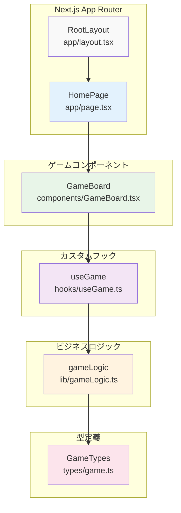
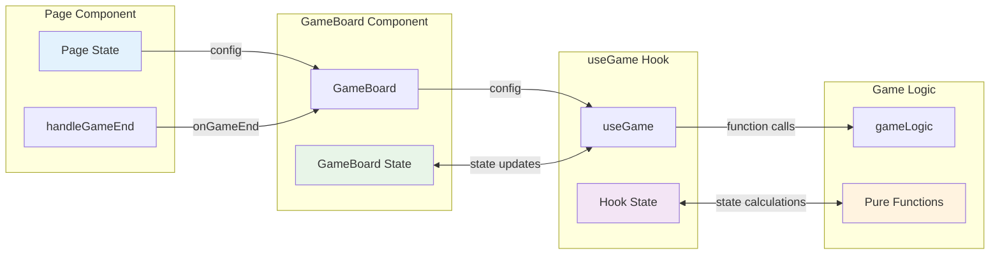
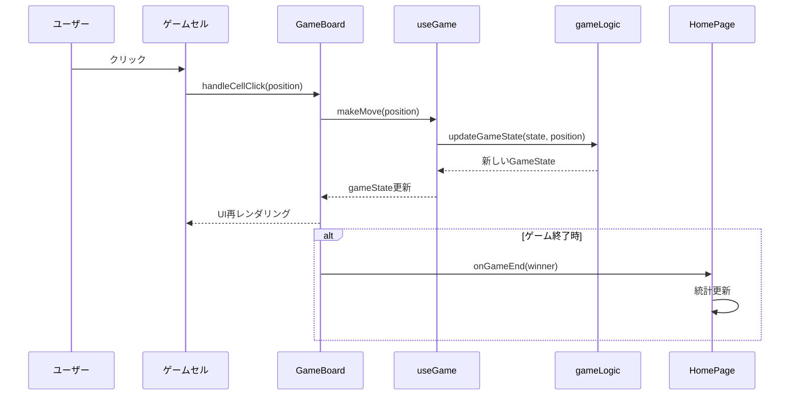

# コンポーネント関係図

## 概要

React コンポーネントの依存関係、プロパティフロー、状態の伝搬パターンを図示します。

## React コンポーネントツリー



## コンポーネント詳細

### 🏠 RootLayout (app/layout.tsx)

```typescript
interface RootLayoutProps {
  children: React.ReactNode;
}
```

**責務**:
- HTML基盤構造の提供
- グローバルフォント設定
- メタデータ定義

**特徴**:
- 全ページ共通レイアウト
- ダークモード CSS変数の設定

### 📄 HomePage (app/page.tsx)

```typescript
interface GameStats {
  totalGames: number;
  wins: { X: number; O: number };
  draws: number;
}
```

**状態管理**:
- `gameHistory`: ゲーム統計データ
- `showStats`: 統計表示/非表示

**主要機能**:
- GameBoard との統合
- 統計機能の提供
- ゲーム結果の記録

**子コンポーネント**:
- `<GameBoard onGameEnd={handleGameEnd} />`

### 🎮 GameBoard (components/GameBoard.tsx)

```typescript
interface GameBoardProps {
  config?: {
    playerXStarts?: boolean;
  };
  onGameEnd?: (winner: "X" | "O" | "draw") => void;
}
```

**使用フック**:
- `useGame(config)`: ゲーム状態管理
- `useState(hasNotifiedGameEnd)`: 通知制御
- `useEffect`: ゲーム終了監視

**主要機能**:
- 3x3グリッドの描画
- セルクリックイベント処理  
- ゲーム状態の表示
- リセット機能

## プロパティフロー図



## 状態伝搬パターン

### 📊 GameBoard → Page (コールバック)

```typescript
// Page Component
const handleGameEnd = (winner: "X" | "O" | "draw") => {
  setGameHistory(prev => ({
    totalGames: prev.totalGames + 1,
    wins: winner !== "draw" 
      ? { ...prev.wins, [winner]: prev.wins[winner] + 1 }
      : prev.wins,
    draws: winner === "draw" ? prev.draws + 1 : prev.draws
  }));
};

// GameBoard Component  
<GameBoard onGameEnd={handleGameEnd} />
```

### 🔄 useGame → GameBoard (状態・関数)

```typescript
// useGame Hook返り値
interface UseGameReturn {
  gameState: GameState;
  makeMove: (position: BoardPosition) => void;
  resetGame: (startingPlayer?: Player) => void;
  isGameFinished: boolean;
  canMakeMove: (position: BoardPosition) => boolean;
}

// GameBoard での使用
const { gameState, makeMove, resetGame, canMakeMove, isGameFinished } = useGame(config);
```

### ⚙️ gameLogic → useGame (純粋関数)

```typescript
// 純粋関数の呼び出し
const makeMove = useCallback((position: BoardPosition) => {
  setGameState(prevState => 
    updateGameState(prevState, position) // 純粋関数
  );
}, []);
```

## イベントフロー



## 状態管理詳細

### 🎯 useGame Hook の状態

```typescript
interface GameState {
  board: BoardCell[];           // [null, "X", "O", ...]
  currentPlayer: Player;        // "X" | "O"
  gameStatus: GameStatus;       // "playing" | "finished" | "draw"
  winner: null | Player;        // null | "X" | "O"
  moves: Move[];               // 手順履歴
}
```

**状態更新フロー**:
1. `makeMove()` 呼び出し
2. `updateGameState()` で新状態計算
3. `setState()` で状態更新
4. React の再レンダリング

### 📈 Page Component の状態

```typescript
interface PageState {
  gameHistory: {
    totalGames: number;
    wins: { X: number; O: number };
    draws: number;
  };
  showStats: boolean;
}
```

**localStorage 連携**:
- `useEffect` で初期読み込み
- 統計更新時に localStorage へ保存

## パフォーマンス最適化

### ⚡ React.memo とコールバック

```typescript
// GameBoard Component (メモ化対象)
export const GameBoard = React.memo(({ config, onGameEnd }: GameBoardProps) => {
  // コンポーネント実装
});

// useGame Hook (useCallback使用)
const makeMove = useCallback((position: BoardPosition) => {
  // 実装
}, []);
```

### 🔧 依存配列の最適化

```typescript
// GameBoard useEffect
useEffect(() => {
  // ゲーム終了監視
}, [isGameFinished, gameState.winner, onGameEnd, hasNotifiedGameEnd]);
```

## エラーハンドリング

### 🛡️ 型安全性による防御

```typescript
// BoardPosition 型による制約
type BoardPosition = 0 | 1 | 2 | 3 | 4 | 5 | 6 | 7 | 8;

// 入力検証
const canMakeMove = (position: BoardPosition): boolean => {
  return gameState.board[position] === null && gameState.gameStatus === "playing";
};
```

### ⚠️ ランタイムエラー対策

```typescript
// セルクリック時の検証
const handleCellClick = (position: BoardPosition) => {
  if (canMakeMove(position)) {
    makeMove(position);
  }
  // 無効な操作は無視される
};
```

## テスト戦略

### 🧪 コンポーネントテスト

```typescript
// GameBoard.test.tsx
describe('GameBoard', () => {
  it('セルクリックで正しくゲーム状態が更新される', () => {
    render(<GameBoard />);
    fireEvent.click(screen.getByTestId('cell-0'));
    expect(screen.getByTestId('cell-0')).toHaveTextContent('X');
  });
});
```

### 🔬 フックテスト

```typescript
// useGame.test.ts  
describe('useGame', () => {
  it('makeMove で正しく状態が更新される', () => {
    const { result } = renderHook(() => useGame());
    act(() => {
      result.current.makeMove(0);
    });
    expect(result.current.gameState.board[0]).toBe('X');
  });
});
```

---

**最終更新**: 2025-06-29  
**バージョン**: Phase 2完了版  
**作成者**: Claude Code