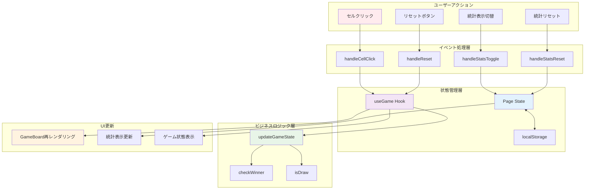
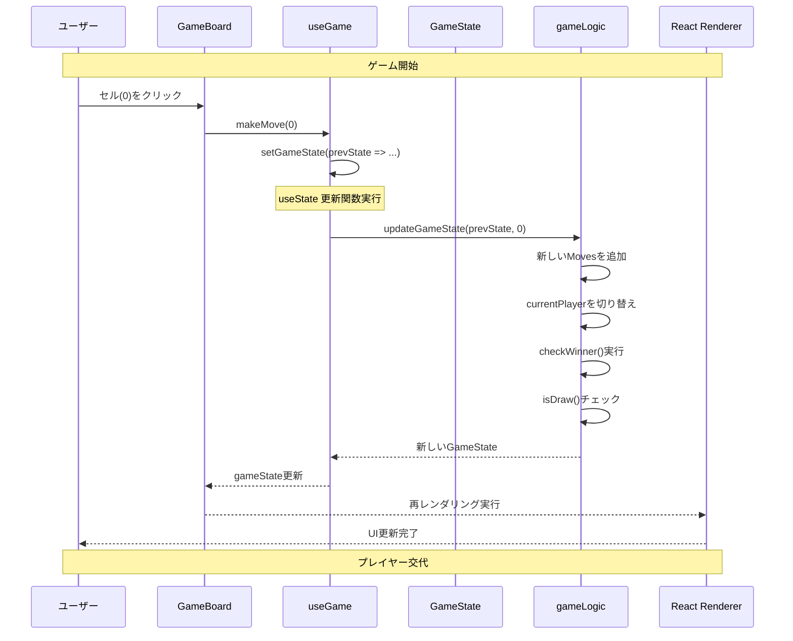
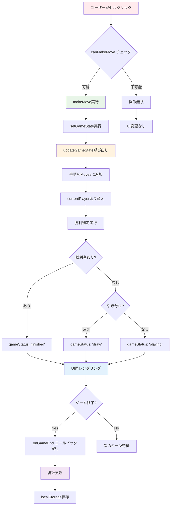
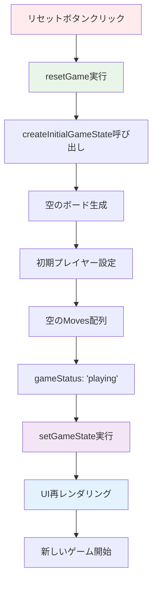
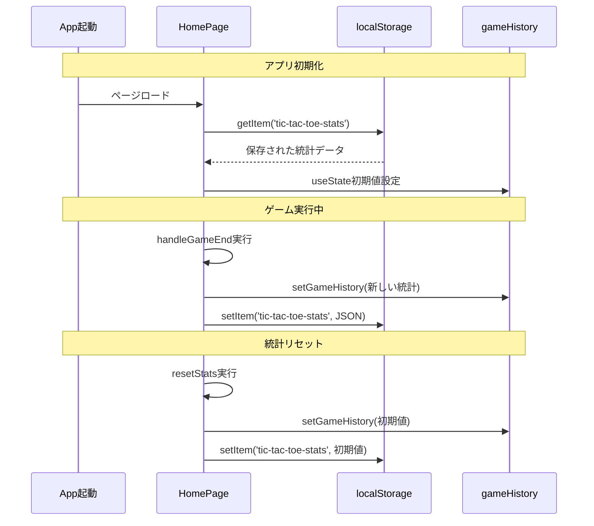
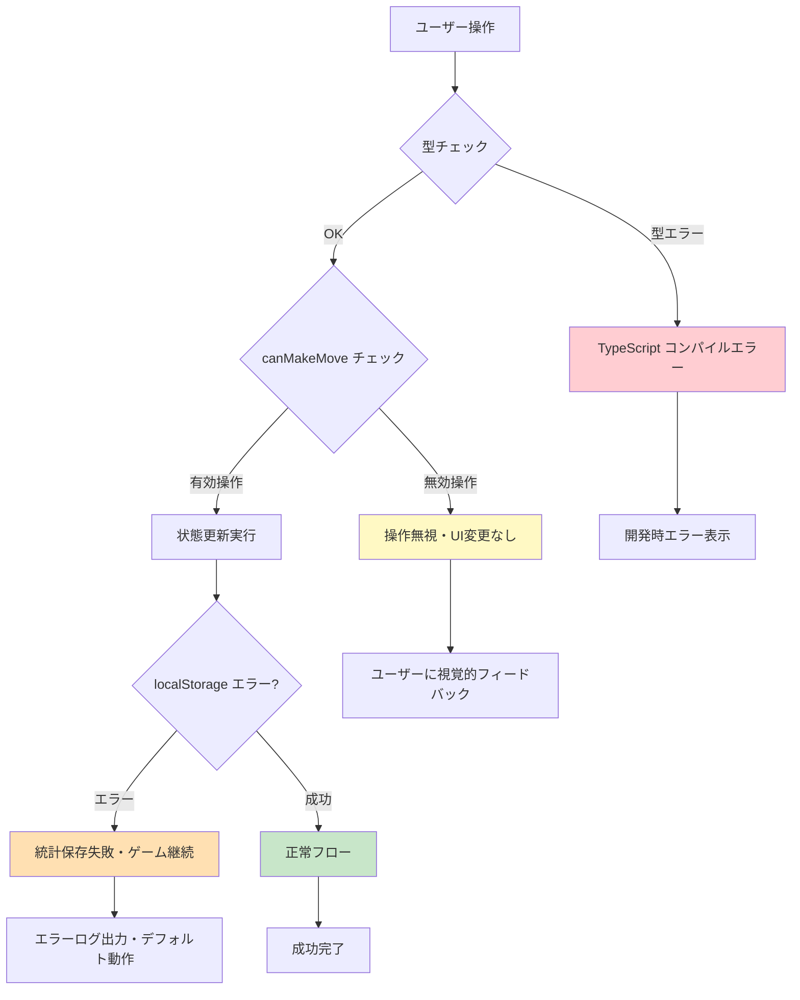

# データフロー図

## 概要

3x3三目並べアプリケーションにおける状態管理、データの流れ、イベント処理パターンを詳細に図示します。

## 全体データフロー概観



## useState/useCallback パターン

### 🎯 useGame Hook 状態管理

```typescript
// hooks/useGame.ts
export function useGame(config?: Partial<GameConfig>): UseGameReturn {
  // 状態定義
  const [gameState, setGameState] = useState<GameState>(
    () => createInitialGameState(initialPlayer)
  );

  // メモ化された関数
  const makeMove = useCallback((position: BoardPosition) => {
    setGameState(prevState => {
      // 条件チェック
      if (prevState.board[position] !== null || prevState.gameStatus !== "playing") {
        return prevState; // 変更なし
      }
      
      // 新しい状態を計算
      return updateGameState(prevState, position);
    });
  }, []);

  const resetGame = useCallback((startingPlayer?: Player) => {
    const player = startingPlayer || (config?.playerXStarts !== false ? "X" : "O");
    setGameState(createInitialGameState(player));
  }, [config?.playerXStarts]);
}
```

### 📊 Page Component 状態管理

```typescript
// app/page.tsx
export default function HomePage() {
  // ゲーム統計状態
  const [gameHistory, setGameHistory] = useState<GameStats>(() => {
    // localStorage から初期値読み込み
    if (typeof window !== 'undefined') {
      const saved = localStorage.getItem('tic-tac-toe-stats');
      return saved ? JSON.parse(saved) : defaultStats;
    }
    return defaultStats;
  });

  // 統計表示状態
  const [showStats, setShowStats] = useState(true);

  // ゲーム終了処理
  const handleGameEnd = useCallback((winner: "X" | "O" | "draw") => {
    setGameHistory(prev => {
      const newHistory = {
        totalGames: prev.totalGames + 1,
        wins: winner !== "draw" 
          ? { ...prev.wins, [winner]: prev.wins[winner] + 1 }
          : prev.wins,
        draws: winner === "draw" ? prev.draws + 1 : prev.draws
      };
      
      // localStorage に保存
      localStorage.setItem('tic-tac-toe-stats', JSON.stringify(newHistory));
      return newHistory;
    });
  }, []);
}
```

## GameState更新サイクル



## イベント処理フロー

### 🖱️ セルクリックフロー



### 🔄 リセットフロー



## localStorage 連携フロー



## React 状態管理詳細

### 🔄 状態更新の流れ

```typescript
// 1. イベント発生
const handleCellClick = (position: BoardPosition) => {
  if (canMakeMove(position)) {
    makeMove(position); // 2. Hook関数呼び出し
  }
};

// 3. useState更新
const makeMove = useCallback((position: BoardPosition) => {
  setGameState(prevState => { // 4. 関数型更新
    return updateGameState(prevState, position); // 5. 純粋関数実行
  });
}, []);

// 6. React再レンダリングスケジュール
// 7. useEffect実行 (依存配列の変更検知)
useEffect(() => {
  if (isGameFinished && onGameEnd && !hasNotifiedGameEnd) {
    const result = gameState.winner || "draw";
    onGameEnd(result); // 8. 親コンポーネントへコールバック
    setHasNotifiedGameEnd(true);
  }
}, [isGameFinished, gameState.winner, onGameEnd, hasNotifiedGameEnd]);
```

### ⚡ パフォーマンス最適化

```typescript
// useCallback によるメモ化
const makeMove = useCallback((position: BoardPosition) => {
  // 関数が再生成されない
}, []); // 依存配列が空

const resetGame = useCallback((startingPlayer?: Player) => {
  // config.playerXStarts が変更時のみ再生成
}, [config?.playerXStarts]);

// useMemo による計算結果キャッシュ
const isGameFinished = useMemo(() => {
  return gameState.gameStatus !== "playing";
}, [gameState.gameStatus]);

const canMakeMove = useCallback((position: BoardPosition): boolean => {
  return gameState.board[position] === null && gameState.gameStatus === "playing";
}, [gameState.board, gameState.gameStatus]);
```

## エラーハンドリングフロー



## 副作用管理

### 📝 useEffect パターン

```typescript
// GameBoard Component
useEffect(() => {
  // ゲーム終了監視
  if (isGameFinished && onGameEnd && !hasNotifiedGameEnd) {
    const result = gameState.winner || "draw";
    onGameEnd(result);
    setHasNotifiedGameEnd(true);
  } else if (!isGameFinished && hasNotifiedGameEnd) {
    // リセット時の処理
    setHasNotifiedGameEnd(false);
  }
}, [isGameFinished, gameState.winner, onGameEnd, hasNotifiedGameEnd]);

// Page Component  
useEffect(() => {
  // localStorage 保存
  localStorage.setItem('tic-tac-toe-stats', JSON.stringify(gameHistory));
}, [gameHistory]);
```

## データ不変性

### 🔒 Immutable 更新パターン

```typescript
// 配列の不変更新
const updateBoard = (board: BoardCell[], position: BoardPosition, player: Player) => {
  const newBoard = [...board]; // スプレッド演算子でコピー
  newBoard[position] = player;
  return newBoard;
};

// オブジェクトの不変更新
const updateStats = (prev: GameStats, winner: GameResult) => ({
  ...prev, // 既存プロパティコピー
  totalGames: prev.totalGames + 1,
  wins: winner !== "draw" 
    ? { ...prev.wins, [winner]: prev.wins[winner] + 1 } // ネストしたオブジェクトも不変更新
    : prev.wins,
  draws: winner === "draw" ? prev.draws + 1 : prev.draws
});

// 配列への要素追加
const addMove = (moves: Move[], newMove: Move) => [...moves, newMove];
```

---

**最終更新**: 2025-06-29  
**バージョン**: Phase 2完了版  
**作成者**: Claude Code