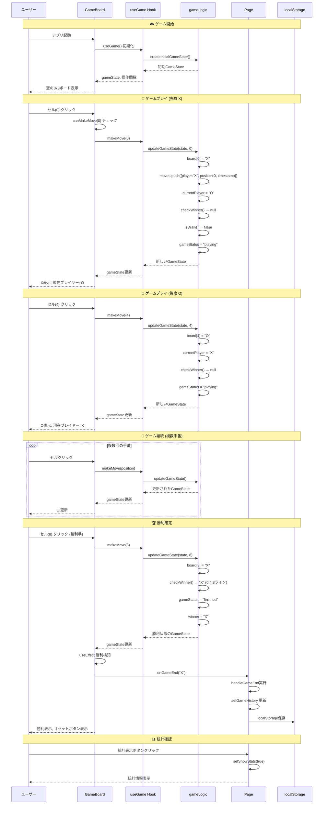
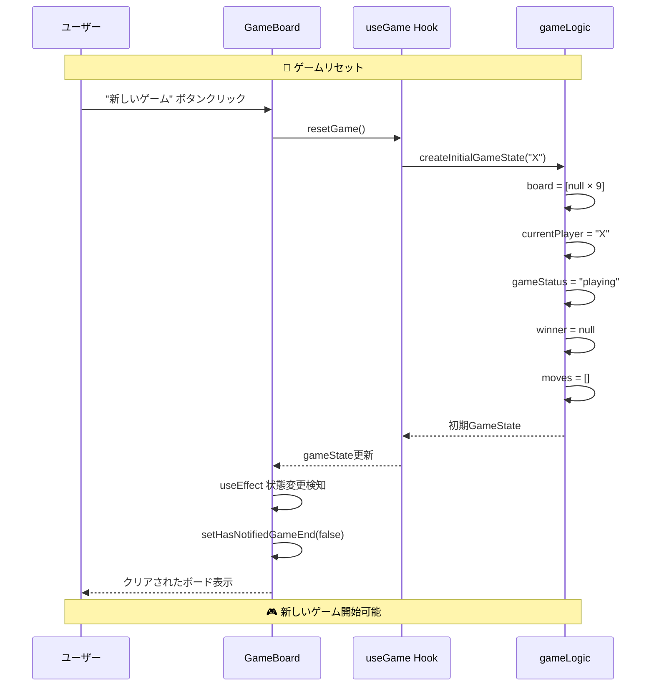
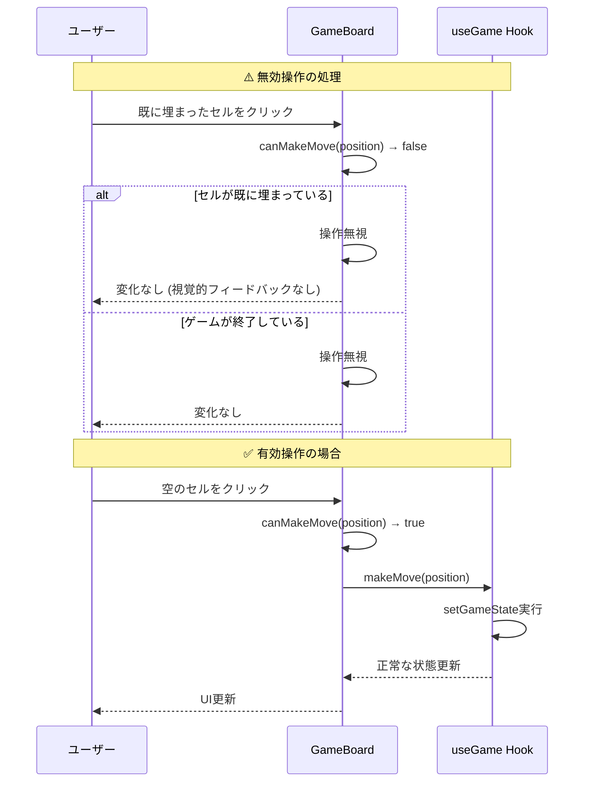
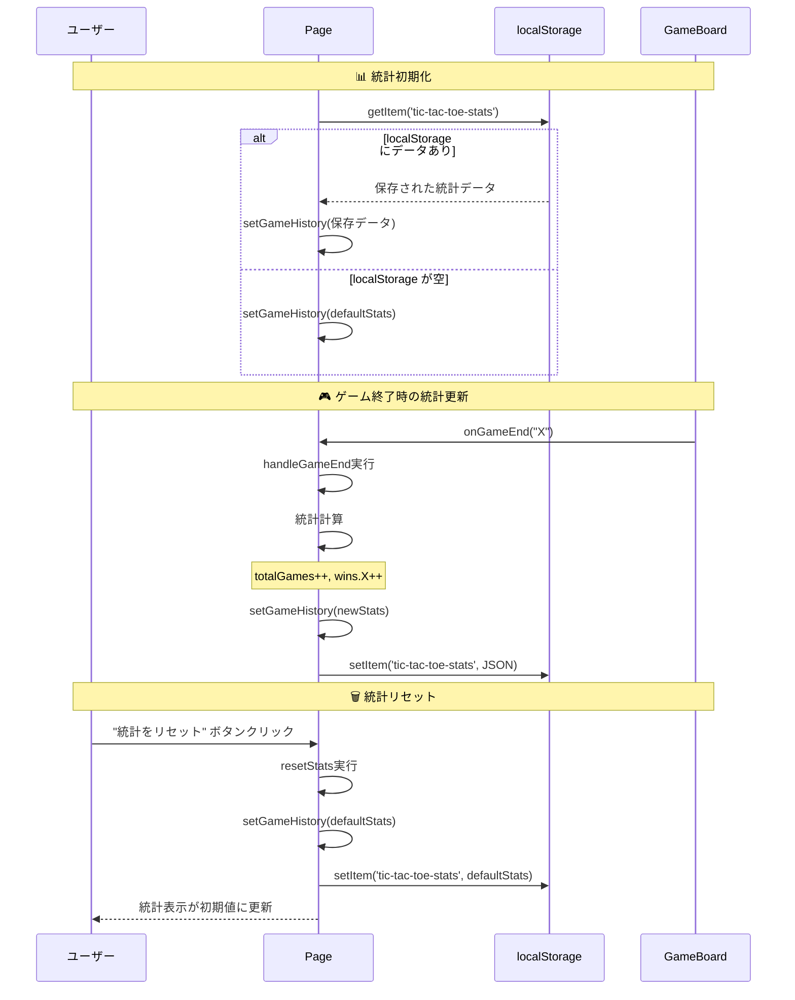
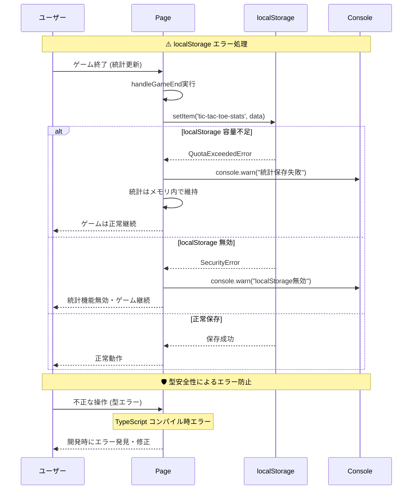
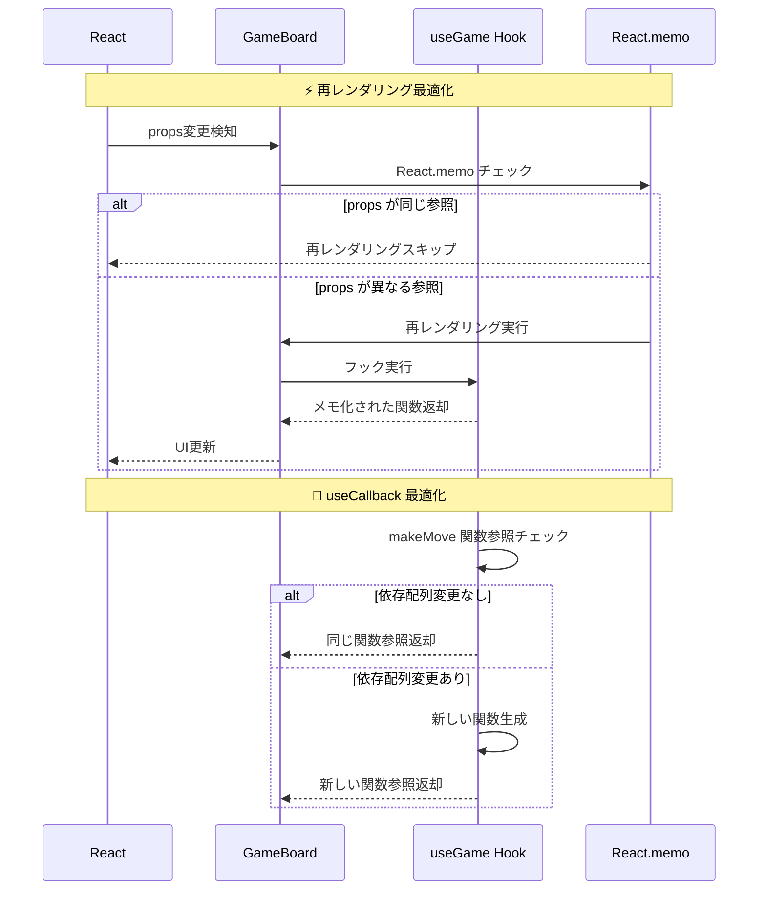
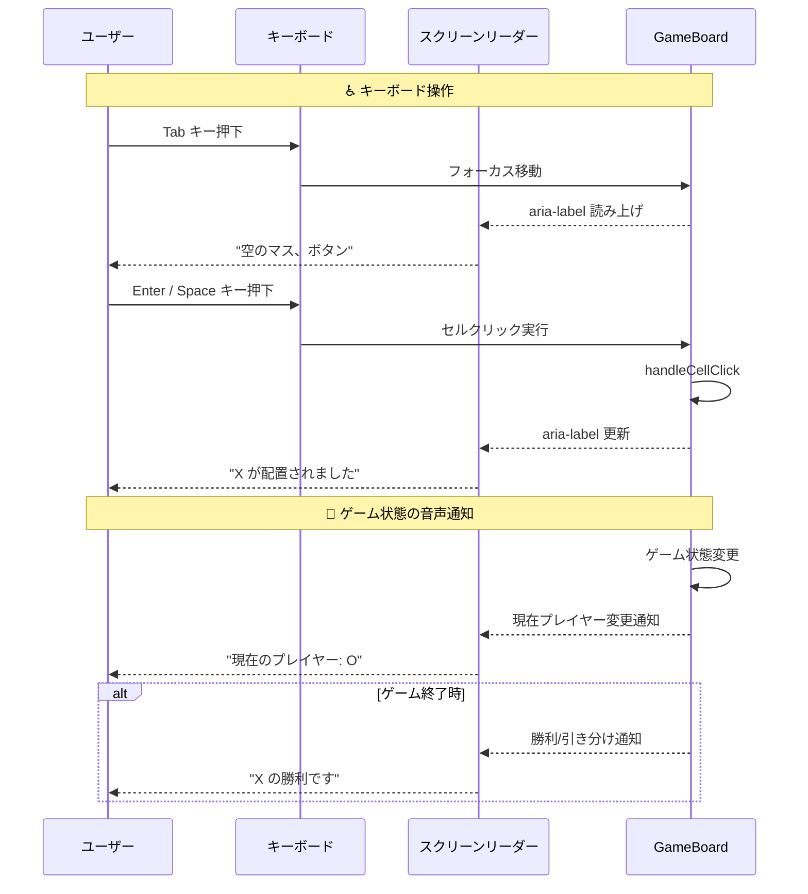
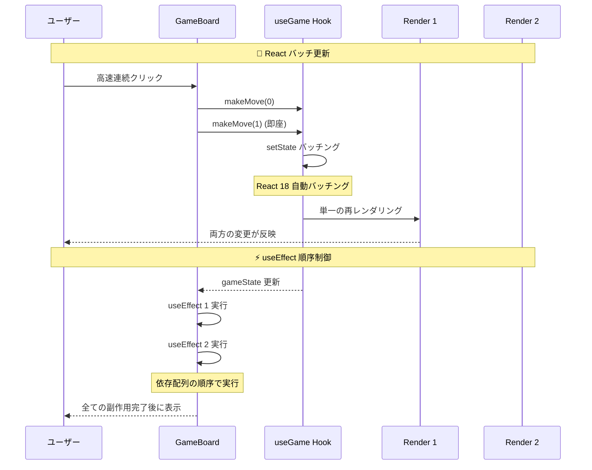

# ゲームフロー・シーケンス図

## 概要

ユーザー操作からゲーム終了までの時系列処理、リセット・統計更新・エラーハンドリングの詳細なシーケンス図を示します。

### 🔰 初心者向け：シーケンス図の読み方

**シーケンス図**は、時間の経過と共に、システムの各部分がどのように連携するかを示した図です。

**読み方のポイント**：
- **縦線**: 各コンポーネントの「ライフライン」（存在期間）
- **横矢印**: 関数呼び出しやデータの受け渡し
- **点線矢印**: 戻り値や非同期処理の結果
- **時間の流れ**: 上から下へ順番に処理が進む

**実際のコードとの対応**：
- 矢印に書かれた関数名が、実際のコードの関数名と一致
- 図を見ながら、実際のファイルを追いかけることが可能

## 完全ゲームフロー



## リセットフロー



## 無効操作のハンドリング



## 統計管理フロー



## エラーハンドリングフロー



## パフォーマンス最適化フロー



## アクセシビリティ対応フロー



## 並行処理・非同期フロー



## 📚 初心者のためのシーケンス図活用ガイド

### 1. ゲームフロー図の読み方手順

**Step 1**: 参加者（participant）を確認
- `U` = ユーザー（あなた）
- `GB` = GameBoardコンポーネント
- `UG` = useGameフック
- `GL` = gameLogicモジュール

**Step 2**: 時間の流れを上から下へ追う

**Step 3**: 矢印の意味を理解
- `→`: 関数呼び出しやメッセージ送信
- `-->>`: 戻り値や非同期結果

### 2. 実際のデバッグでの活用方法

**例**: セルクリックが動作しない場合

1. **シーケンス図で流れを確認**
   ```
   ユーザー → GameBoard → useGame → gameLogic
   ```

2. **各ステップでデバッグ**
   ```javascript
   // GameBoard.tsx
   const handleCellClick = (position) => {
     console.log('handleCellClick called:', position); // ①
     if (canMakeMove(position)) {
       console.log('makeMove will be called'); // ②
       makeMove(position);
     }
   };
   ```

3. **問題箇所の特定**
   - ①が表示されない → クリックイベントの問題
   - ②が表示されない → `canMakeMove` の問題
   - ②まで表示される → `useGame` フックの問題

### 3. エラーハンドリングフローの理解

**無効操作の場合**：
```
ユーザーが埋まったセルをクリック
 → GameBoard.canMakeMove(position) → false
 → 操作無視（UI変化なし）
```

**localStorageエラーの場合**：
```
統計保存失敗
 → console.warn でエラーログ出力
 → ゲームは継続（統計はメモリ内のみ）
```

### 4. パフォーマンス最適化の理解

**Reactのバッチ更新**：
```
高速連続クリック
 → React 18 が自動でバッチング
 → 単一の再レンダリングで両方の変化を反映
```

---

**最終更新**: 2025-06-29  
**バージョン**: Phase 4完了版（初心者ガイド追加）  
**作成者**: Claude Code
