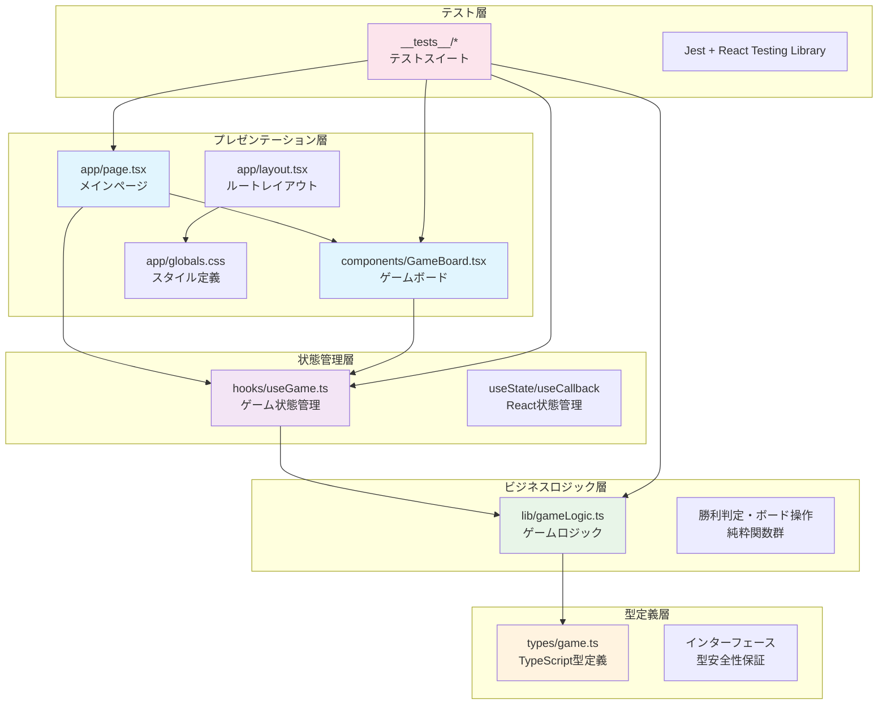
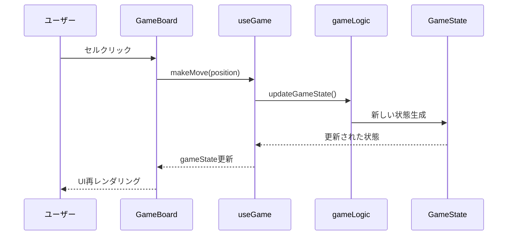

# システム構成図

## 概要

3x3三目並べゲームのシステムアーキテクチャは、明確な責務分離を持つレイヤード構造で設計されています。

## アーキテクチャ概観

## 層別詳細

### 🖼️ プレゼンテーション層
**責務**: ユーザーインターフェース・表示制御・イベント処理

| ファイル | 責務 | 主要機能 |
|---------|------|---------|
| `app/page.tsx` | メインページコンポーネント | ゲーム統合・統計表示・全体レイアウト |
| `app/layout.tsx` | アプリケーション基盤 | HTML構造・メタデータ・フォント設定 |
| `components/GameBoard.tsx` | ゲームUI | 3x3グリッド・セル操作・ゲーム情報表示 |
| `app/globals.css` | スタイル定義 | ダークモード・CSS変数・基本スタイル |

### 🔄 状態管理層
**責務**: アプリケーション状態管理・副作用制御

| ファイル | 責務 | 主要機能 |
|---------|------|---------|
| `hooks/useGame.ts` | ゲーム状態管理 | 盤面状態・手順履歴・ゲーム制御 |
| React Hooks | 状態管理プリミティブ | useState・useCallback・useEffect |

### ⚙️ ビジネスロジック層
**責務**: ゲームルール・計算処理・純粋関数

| ファイル | 責務 | 主要機能 |
|---------|------|---------|
| `lib/gameLogic.ts` | コアゲームロジック | 勝利判定・盤面操作・状態更新 |

**主要関数**:
- `checkWinner()`: 勝利判定
- `isDraw()`: 引き分け判定  
- `updateGameState()`: 状態更新
- `createInitialGameState()`: 初期化

### 📋 型定義層
**責務**: 型安全性保証・インターフェース定義

| ファイル | 責務 | 主要型 |
|---------|------|--------|
| `types/game.ts` | 型定義 | `GameState`・`Player`・`BoardPosition`・`GameRecord` |

### 🧪 テスト層
**責務**: 品質保証・リグレッション防止

| ディレクトリ | 対象 | テスト数 |
|-------------|------|--------|
| `lib/__tests__/` | ビジネスロジック | 包括的テスト |
| `hooks/__tests__/` | 状態管理 | 12テストケース |
| `components/__tests__/` | UI/UX | 13テストケース |
| `app/__tests__/` | 統合テスト | 11テストケース |

## データフロー

## 設計原則

### 🏗️ レイヤード設計
- **単方向依存**: 上位層のみが下位層に依存
- **責務分離**: 各層が明確な責務を持つ
- **疎結合**: インターフェースを通じた結合

### 🔒 型安全性
- **厳密な型定義**: TypeScript活用
- **コンパイル時チェック**: 実行時エラー防止
- **インターフェース駆動**: 実装詳細の隠蔽

### 🧪 テスタビリティ
- **純粋関数中心**: 副作用の最小化
- **依存性注入**: テスト容易性向上
- **包括的カバレッジ**: 75テストケース

### ⚡ パフォーマンス
- **React.memo**: 不要な再レンダリング防止
- **useCallback**: 関数の最適化
- **効率的な状態管理**: 最小限の状態更新

## 技術選定理由

| 技術 | 選定理由 |
|------|---------|
| **Next.js 15** | App Router・パフォーマンス・開発体験 |
| **TypeScript** | 型安全性・開発効率・リファクタリング安全性 |
| **Tailwind CSS** | ユーティリティファースト・ダークモード・保守性 |
| **Jest + RTL** | React専用テスト・コンポーネントテスト・スナップショット |

## 拡張性の考慮

### 🔮 Future Phase対応
- **AI実装**: `lib/aiPlayer.ts` 追加予定
- **棋譜機能**: `lib/repository.ts` でデータ永続化
- **マルチプレイヤー**: WebSocket層追加可能

### 🌐 スケーラビリティ
- **クラウドDB移行**: リポジトリパターンで実装変更のみ
- **認証機能**: 既存構造に認証層追加
- **モバイルアプリ**: React Native移植容易

## セキュリティ設計

### 🛡️ 脆弱性対策
- **XSS対策**: React標準のエスケープ
- **型検証**: TypeScriptによる型安全性
- **入力検証**: BoardPosition型による制約

### 🔐 データ保護
- **localStorage**: クライアントサイドのみ
- **機密情報なし**: ゲームデータのみ保存
- **将来の暗号化**: クラウド移行時に実装予定

---

**最終更新**: 2025-06-29  
**バージョン**: Phase 2完了版  
**作成者**: Claude Code