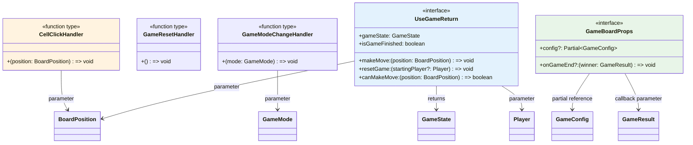

# 型関係図

## 概要

TypeScript 型の構造、相互関係、インターフェースの継承・拡張パターンを詳細に図示します。

## 型システム全体図

```mermaid
classDiagram
    class Player {
        <<type>>
        +string: "X" | "O"
    }
    
    class BoardPosition {
        <<type>>
        +number: 0|1|2|3|4|5|6|7|8
    }
    
    class BoardCell {
        <<type>>
        +null | Player
    }
    
    class GameMode {
        <<type>>
        +string: "pvp" | "pvc"
    }
    
    class GameStatus {
        <<type>>
        +string: "playing" | "finished" | "draw"
    }
    
    class GameResult {
        <<type>>
        +Player | "draw"
    }
    
    class Move {
        <<interface>>
        +player: Player
        +position: BoardPosition
        +timestamp: number
    }
    
    class GameState {
        <<interface>>
        +board: BoardCell[]
        +currentPlayer: Player
        +gameStatus: GameStatus
        +winner: null | Player
        +moves: Move[]
    }
    
    class GameRecord {
        <<interface>>
        +id: string
        +timestamp: number
        +gameMode: GameMode
        +moves: Move[]
        +result: GameResult
        +duration: number
        +playerXStarts: boolean
    }
    
    class WinCondition {
        <<interface>>
        +positions: [BoardPosition, BoardPosition, BoardPosition]
        +player: Player
    }
    
    class GameConfig {
        <<interface>>
        +mode: GameMode
        +playerXStarts: boolean
        +aiDifficulty?: "easy" | "medium" | "hard"
    }
    
    class GameRepository {
        <<interface>>
        +saveGame(game: GameRecord): Promise~void~
        +loadGames(): Promise~GameRecord[]~
        +deleteGame(id: string): Promise~void~
        +clearAll(): Promise~void~
    }
    
    class GameStats {
        <<interface>>
        +totalGames: number
        +wins: {X: number, O: number}
        +draws: number
        +averageDuration: number
        +longestGame: number
        +shortestGame: number
    }
    
    %% 関係性
    BoardCell --> Player : contains
    Move --> Player : references
    Move --> BoardPosition : references
    GameState --> BoardCell : contains array
    GameState --> Player : references
    GameState --> GameStatus : references
    GameState --> Move : contains array
    GameRecord --> GameMode : references
    GameRecord --> Move : contains array
    GameRecord --> GameResult : references
    WinCondition --> BoardPosition : contains tuple
    WinCondition --> Player : references
    GameConfig --> GameMode : references
    GameRepository --> GameRecord : operates on
    GameStats --> Player : references (in wins object)
    
    style Player fill:#ffebee
    style BoardPosition fill:#e8f5e8
    style GameState fill:#e3f2fd
    style GameRecord fill:#f3e5f5
    style GameRepository fill:#fff3e0
```

## コア型詳細

### 🎮 基本ゲーム型

```typescript
// プレイヤー型：厳密な文字列リテラル
type Player = "X" | "O";

// ボード位置型：配列インデックスの型安全性
type BoardPosition = 0 | 1 | 2 | 3 | 4 | 5 | 6 | 7 | 8;

// ボードセル型：Union型による状態表現
type BoardCell = null | Player;

// ゲームモード型：将来の拡張を見据えた設計
type GameMode = "pvp" | "pvc"; // Player vs Player, Player vs Computer

// ゲーム状態型：状態遷移の明確化
type GameStatus = "playing" | "finished" | "draw";

// ゲーム結果型：勝者または引き分けの表現
type GameResult = Player | "draw";
```

### 📋 インターフェース型

```typescript
// 手順の詳細情報
interface Move {
  player: Player;           // 手を打ったプレイヤー
  position: BoardPosition;  // 位置（型安全）
  timestamp: number;        // タイムスタンプ（ミリ秒）
}

// ゲーム状態の完全な定義
interface GameState {
  board: BoardCell[];       // 9要素の配列（型安全）
  currentPlayer: Player;    // 現在のターン
  gameStatus: GameStatus;   // ゲームの進行状態
  winner: null | Player;    // 勝者（未決定時はnull）
  moves: Move[];           // 手順履歴（順序保証）
}

// 永続化用ゲーム記録
interface GameRecord {
  id: string;              // UUID等のユニークID
  timestamp: number;       // ゲーム開始時刻
  gameMode: GameMode;      // 対戦モード
  moves: Move[];          // 完全な手順履歴
  result: GameResult;     // 最終結果
  duration: number;       // ゲーム時間（秒）
  playerXStarts: boolean; // 先攻情報
}

// 勝利条件の定義
interface WinCondition {
  positions: [BoardPosition, BoardPosition, BoardPosition]; // タプル型で固定長
  player: Player;                                           // 勝利プレイヤー
}
```

## 関数型定義



### 🔧 関数型・ハンドラー型

```typescript
// イベントハンドラー型
type CellClickHandler = (position: BoardPosition) => void;
type GameResetHandler = () => void;
type GameModeChangeHandler = (mode: GameMode) => void;

// フック返り値型
interface UseGameReturn {
  gameState: GameState;
  makeMove: (position: BoardPosition) => void;
  resetGame: (startingPlayer?: Player) => void;
  isGameFinished: boolean;
  canMakeMove: (position: BoardPosition) => boolean;
}

// コンポーネントプロパティ型
interface GameBoardProps {
  config?: Partial<GameConfig>;                    // 部分的設定（オプション）
  onGameEnd?: (winner: GameResult) => void;       // ゲーム終了コールバック
}
```

## 型の依存関係

```mermaid
graph TB
    subgraph "プリミティブ型"
        Player[Player<br/>"X" | "O"]
        BoardPosition[BoardPosition<br/>0..8]
        GameMode[GameMode<br/>"pvp" | "pvc"]
        GameStatus[GameStatus<br/>"playing" | ...]
    end
    
    subgraph "Union型"
        BoardCell[BoardCell<br/>null | Player]
        GameResult[GameResult<br/>Player | "draw"]
    end
    
    subgraph "基本インターフェース"
        Move[Move<br/>player, position, timestamp]
        WinCondition[WinCondition<br/>positions, player]
    end
    
    subgraph "複合インターフェース"
        GameState[GameState<br/>board, currentPlayer, ...]
        GameConfig[GameConfig<br/>mode, playerXStarts, ...]
        GameRecord[GameRecord<br/>id, timestamp, moves, ...]
    end
    
    subgraph "統計・リポジトリ"
        GameStats[GameStats<br/>totalGames, wins, ...]
        GameRepository[GameRepository<br/>saveGame, loadGames, ...]
    end
    
    subgraph "React型"
        UseGameReturn[UseGameReturn<br/>gameState, makeMove, ...]
        GameBoardProps[GameBoardProps<br/>config, onGameEnd]
    end
    
    %% 依存関係
    BoardCell --> Player
    GameResult --> Player
    Move --> Player
    Move --> BoardPosition
    WinCondition --> BoardPosition
    WinCondition --> Player
    
    GameState --> BoardCell
    GameState --> Player
    GameState --> GameStatus
    GameState --> Move
    
    GameConfig --> GameMode
    GameRecord --> GameMode
    GameRecord --> Move
    GameRecord --> GameResult
    
    GameStats --> Player
    GameRepository --> GameRecord
    
    UseGameReturn --> GameState
    UseGameReturn --> BoardPosition
    UseGameReturn --> Player
    GameBoardProps --> GameConfig
    GameBoardProps --> GameResult
    
    style Player fill:#ffebee
    style BoardPosition fill:#e8f5e8
    style GameState fill:#e3f2fd
    style UseGameReturn fill:#f3e5f5
```

## 型安全性の設計パターン

### 🛡️ 厳密な型制約

```typescript
// 1. リテラル型による制約
type Player = "X" | "O"; // string ではなく厳密なリテラル

// 2. 数値範囲の型制約
type BoardPosition = 0 | 1 | 2 | 3 | 4 | 5 | 6 | 7 | 8; // number ではなく範囲制限

// 3. タプル型による固定長配列
type WinLine = [BoardPosition, BoardPosition, BoardPosition]; // 必ず3要素

// 4. 条件型による柔軟な制約
type GameEndCallback<T extends GameResult> = (winner: T) => void;
```

### 🔒 Null安全性

```typescript
// Optional chaining の活用
interface GameConfig {
  mode: GameMode;
  playerXStarts: boolean;
  aiDifficulty?: "easy" | "medium" | "hard"; // オプショナル
}

// Union型による明示的なNull表現
interface GameState {
  winner: null | Player; // undefined ではなく null を明示
}

// 型ガードによる安全なアクセス
function isGameFinished(state: GameState): state is GameState & { winner: Player } {
  return state.gameStatus === "finished" && state.winner !== null;
}
```

## ジェネリック型の活用

```mermaid
classDiagram
    class Repository~T~ {
        <<generic interface>>
        +save(item: T): Promise~void~
        +load(): Promise~T[]~
        +delete(id: string): Promise~void~
    }
    
    class LocalStorageRepository {
        <<concrete class>>
        +implements Repository~GameRecord~
        +STORAGE_KEY: string
        +save(game: GameRecord): Promise~void~
        +load(): Promise~GameRecord[]~
        +delete(id: string): Promise~void~
    }
    
    class FirebaseRepository {
        <<future class>>
        +implements Repository~GameRecord~
        +collection: string
        +save(game: GameRecord): Promise~void~
        +load(): Promise~GameRecord[]~
        +delete(id: string): Promise~void~
    }
    
    Repository~T~ <|-- LocalStorageRepository : implements
    Repository~T~ <|-- FirebaseRepository : implements
    
    style Repository~T~ fill:#fff3e0
    style LocalStorageRepository fill:#e8f5e8
    style FirebaseRepository fill:#f3e5f5
```

### 🎯 ジェネリック設計

```typescript
// 汎用リポジトリインターフェース
interface Repository<T> {
  save(item: T): Promise<void>;
  load(): Promise<T[]>;
  delete(id: string): Promise<void>;
  clearAll(): Promise<void>;
}

// 具体的な実装
class LocalStorageRepository implements Repository<GameRecord> {
  private readonly STORAGE_KEY = "tic-tac-toe-games";
  
  async save(game: GameRecord): Promise<void> {
    // 実装
  }
  
  async load(): Promise<GameRecord[]> {
    // 実装
  }
}

// 将来の Firebase 実装
class FirebaseRepository implements Repository<GameRecord> {
  // Firebase 固有の実装
}
```

## 型の拡張パターン

### 📈 インターフェース拡張

```typescript
// 基本設定
interface BaseGameConfig {
  mode: GameMode;
  playerXStarts: boolean;
}

// AI設定拡張
interface AIGameConfig extends BaseGameConfig {
  mode: "pvc";
  aiDifficulty: "easy" | "medium" | "hard";
  aiPlayer: Player;
}

// マルチプレイヤー設定拡張
interface MultiplayerGameConfig extends BaseGameConfig {
  mode: "multiplayer";
  sessionId: string;
  playerId: string;
}

// Union型による統合
type GameConfig = BaseGameConfig | AIGameConfig | MultiplayerGameConfig;
```

### 🔧 Utility Types の活用

```typescript
// Partial: オプショナル化
type PartialGameConfig = Partial<GameConfig>;

// Pick: 特定プロパティの抽出
type GameSummary = Pick<GameRecord, "id" | "result" | "duration">;

// Omit: 特定プロパティの除外
type GameRecordInput = Omit<GameRecord, "id" | "timestamp">;

// Record: キー・値の型定義
type PlayerStats = Record<Player, number>;

// 条件型: 型レベルの条件分岐
type GameModeConfig<T extends GameMode> = T extends "pvc" 
  ? AIGameConfig 
  : BaseGameConfig;
```

## 型エラー防止パターン

### ⚠️ ランタイムエラー防止

```typescript
// 1. 配列インデックスの型安全性
function getCell(board: BoardCell[], position: BoardPosition): BoardCell {
  return board[position]; // position は 0-8 に制限されているため安全
}

// 2. switch文の網羅性チェック
function getPlayerName(player: Player): string {
  switch (player) {
    case "X":
      return "プレイヤーX";
    case "O":
      return "プレイヤーO";
    default:
      // never型により、すべてのケースが処理されることを保証
      const _exhaustive: never = player;
      throw new Error(`未対応のプレイヤー: ${_exhaustive}`);
  }
}

// 3. 型アサーション関数
function assertIsPlayer(value: unknown): asserts value is Player {
  if (value !== "X" && value !== "O") {
    throw new Error(`Invalid player: ${value}`);
  }
}
```

---

**最終更新**: 2025-06-29  
**バージョン**: Phase 2完了版  
**作成者**: Claude Code