# UI/UXフロー図

## 概要

ユーザーインタラクション、画面要素の相互作用、アクセシビリティ考慮点を詳細に図示します。

### 🔰 初心者向け：UI/UXフロー図とは？

**UI/UXフロー図**は、ユーザーがアプリケーションを使う際の体験と操作の流れを視覚化したものです。

**読み方のポイント**：
- **ユーザージャーニー**: ユーザーの体験の時系列変化
- **インタラクションフロー**: クリック、タップ、キーボード操作の反応
- **アクセシビリティ**: 障害を持つユーザーへの配慮
- **レスポンシブデザイン**: 異なるデバイスでの表示適応

**実用的な活用方法**：
- UI改善：ユーザビリティの問題箇所を特定
- テスト計画：ユーザーシナリオの作成
- 機能追加：新機能がUXに与える影響の事前評価

## ユーザージャーニー全体図

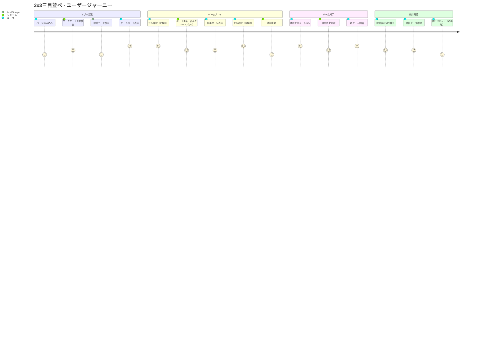

## インタラクション設計

### 🖱️ マウス・タッチ操作フロー

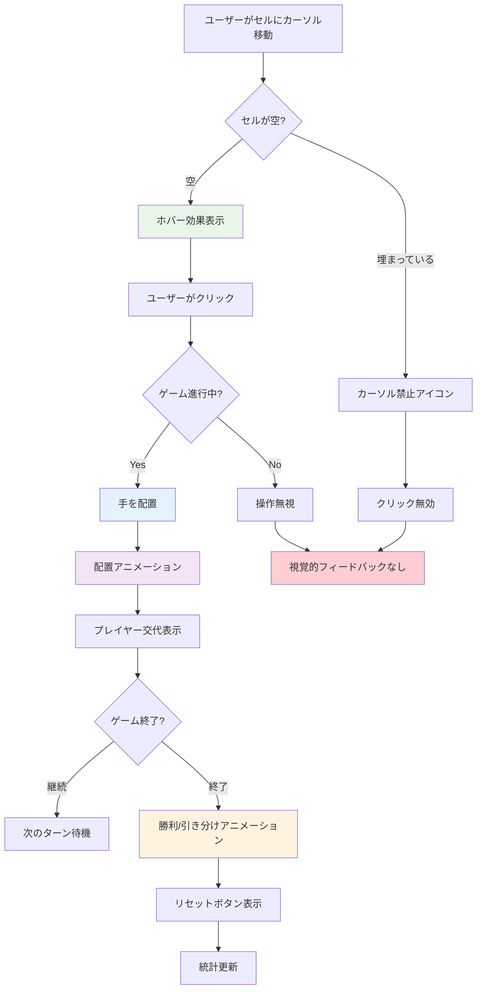

### ⌨️ キーボード操作フロー

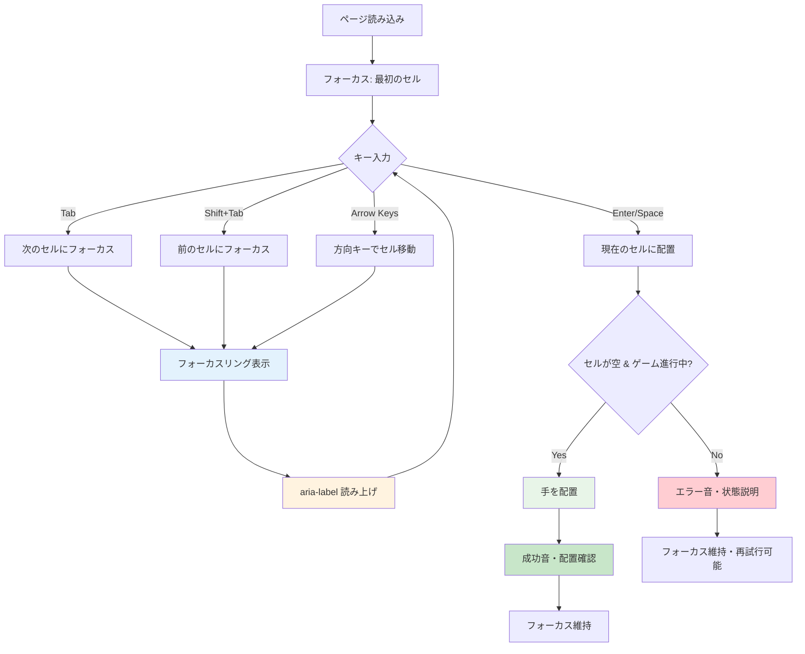

## 画面要素の相互作用

### 🎮 ゲームボードエリア

```mermaid
graph TB
    subgraph "ゲームボードコンテナ"
        A[3x3グリッド]
        B[ゲーム状態表示]
        C[リセットボタン]
        D[ゲーム情報]
    end

    subgraph "セルインタラクション"
        E[セル(0-8)]
        F[ホバー効果]
        G[クリックアニメーション]
        H[フォーカス表示]
    end

    subgraph "状態フィードバック"
        I[現在プレイヤー表示]
        J[手数カウンタ]
        K[勝利メッセージ]
        L[先攻情報]
    end

    A --> E
    E --> F
    E --> G
    E --> H

    B --> I
    B --> K
    D --> J
    D --> L

    C --> M[ゲームリセット]
    M --> N[統計保持]

    K --> O[祝福アニメーション]

    style A fill:#e3f2fd
    style F fill:#e8f5e8
    style I fill:#fff3e0
    style K fill:#f3e5f5
```

### 📊 統計エリア

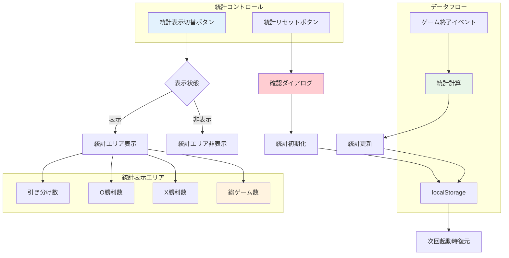

## レスポンシブデザインフロー

### 📱 デバイス別適応

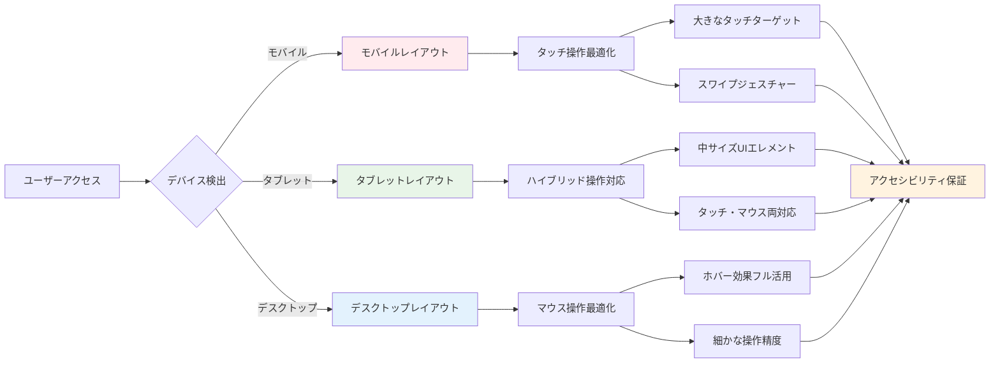

### 🌐 ビューポート適応

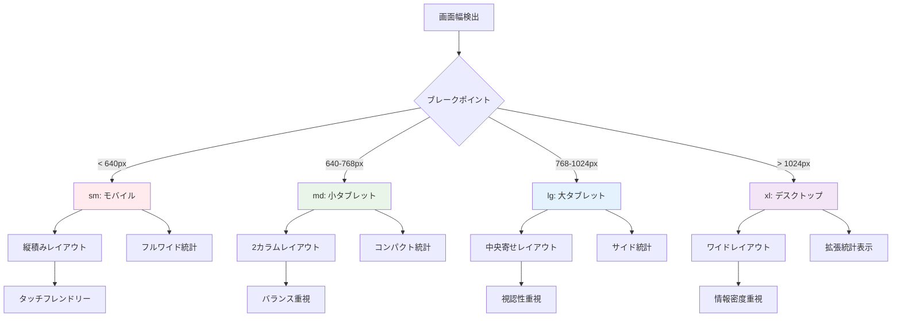

## アクセシビリティフロー

### ♿ スクリーンリーダー対応

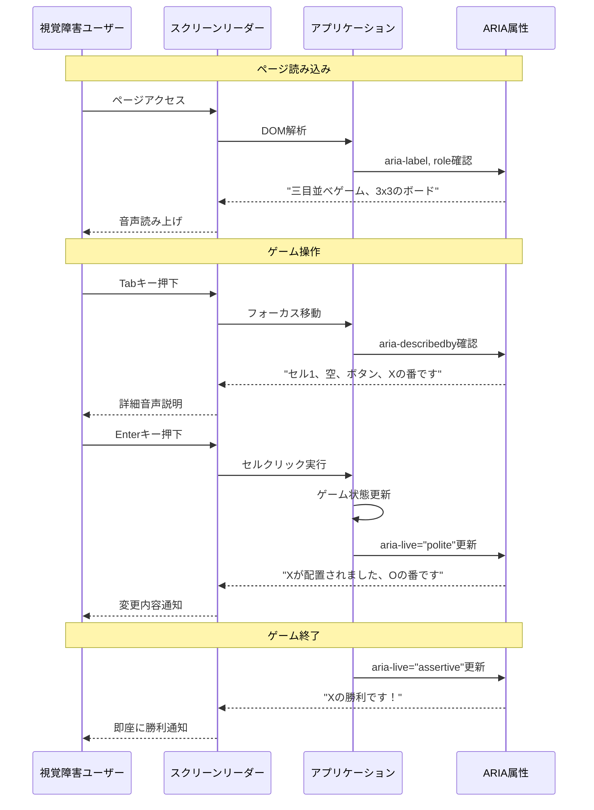

### 🎹 キーボードナビゲーション

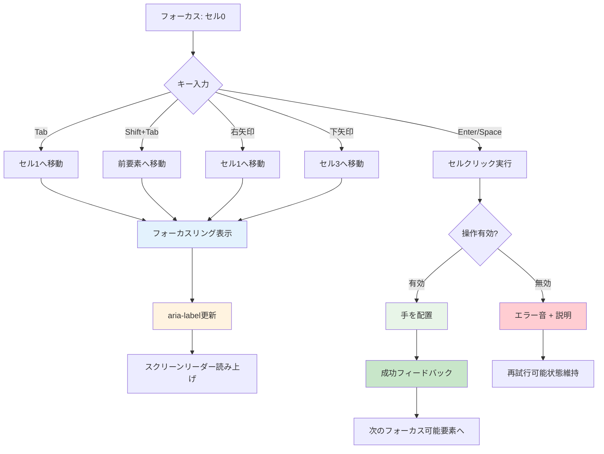

## ダークモード切り替えフロー

```mermaid
flowchart TD
    A[ページ読み込み] --> B{システム設定確認}

    B -->|prefers-color-scheme: dark| C[ダークモード適用]
    B -->|prefers-color-scheme: light| D[ライトモード適用]
    B -->|設定なし| E[ライトモード（デフォルト）]

    C --> F[CSS変数更新]
    D --> F
    E --> F

    F --> G[--background: 値設定]
    F --> H[--foreground: 値設定]

    G --> I[全要素の背景色更新]
    H --> J[全要素のテキスト色更新]

    I --> K[アニメーション付き遷移]
    J --> K

    K --> L[ユーザーに即座に反映]

    M[システム設定変更] --> N[媒体クエリ検知]
    N --> O[自動切り替え実行]
    O --> F

    style C fill:#424242
    style D fill:#fafafa
    style K fill:#e3f2fd
    style O fill:#fff3e0
```

## エラー状態のUXフロー

### ⚠️ ユーザーエラー処理

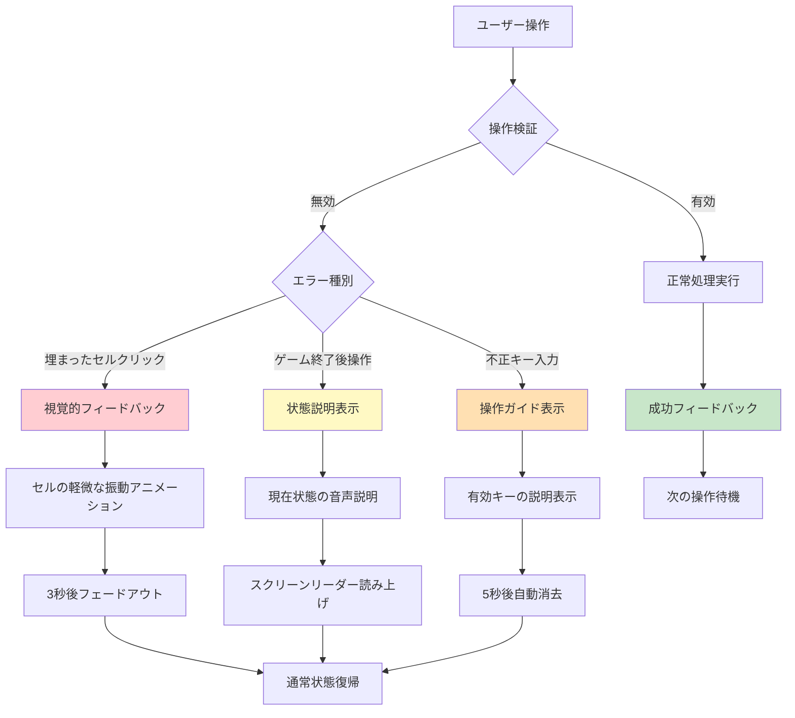

### 🔧 システムエラー処理

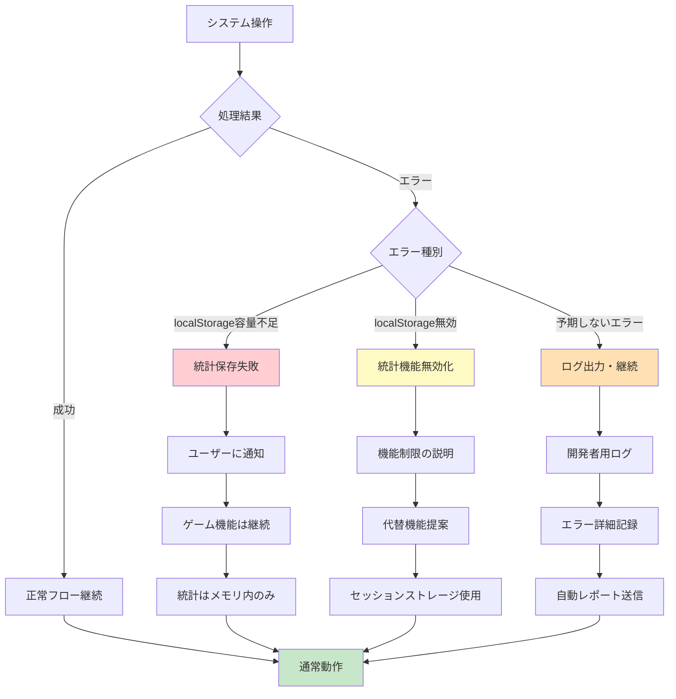

## パフォーマンス最適化UX

### ⚡ 読み込み体験

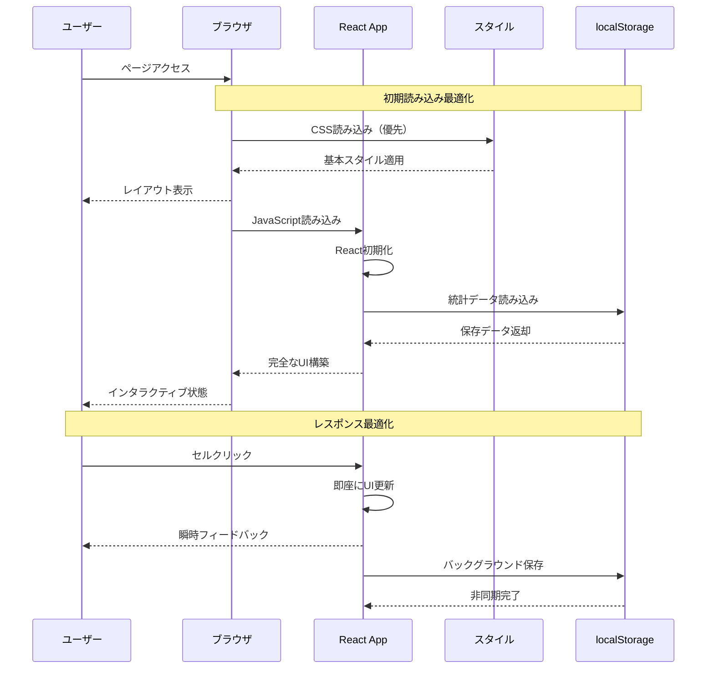

### 🎨 アニメーション体験

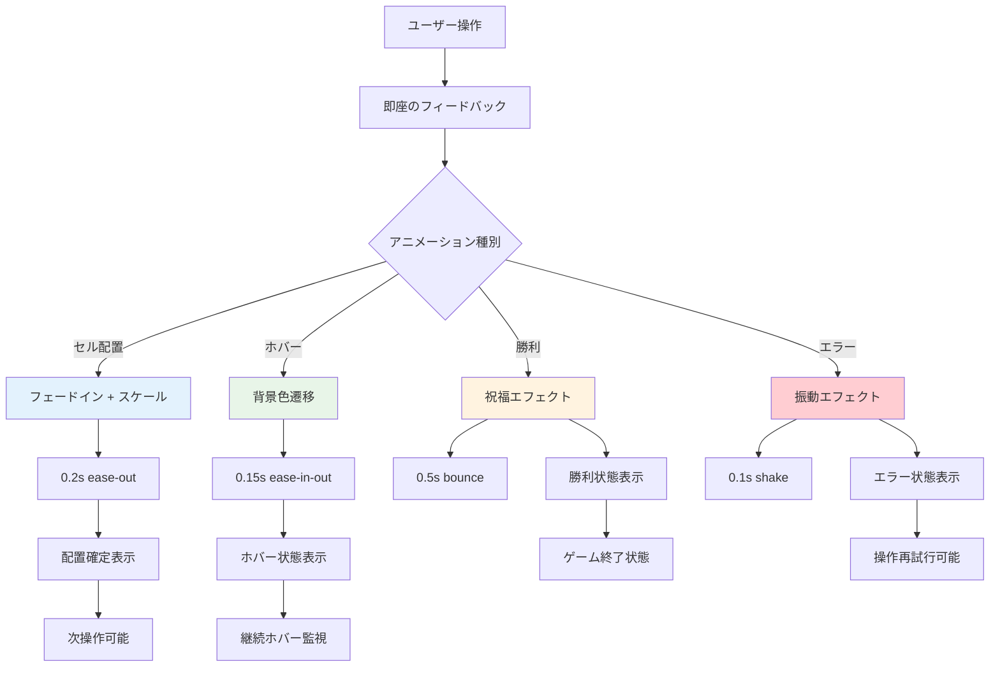

## 📚 初心者のためのUI/UX学習ガイド

### 1. ユーザージャーニー図の読み方

**満足度スコアの意味**：
- **5**: 非常に満足（直感的で簡単）
- **4**: 満足（適度な快適さ）
- **3**: 中立（可も不可もない）
- **2**: 不満（改善の余地あり）
- **1**: 非常に不満（早急な改善が必要）

**改善優先度の特定**：
スコアが低いステップ = 改善すべき箇所

### 2. インタラクションフローの実装方法

**ホバー効果の実装**：
```css
/* Tailwind CSS */
.cell:hover {
  @apply bg-gray-100 dark:bg-gray-700 transition-colors duration-150;
}
```

**クリックアニメーション**：
```css
.cell:active {
  @apply scale-95 transition-transform duration-100;
}
```

**フォーカス表示**：
```css
.cell:focus {
  @apply ring-2 ring-blue-500 ring-offset-2 outline-none;
}
```

### 3. アクセシビリティの実装例

**ARIAラベルの設定**：
```tsx
<button
  aria-label="セル 1、空、Xの番です"
  aria-describedby="game-status"
  role="button"
>
```

**キーボードナビゲーション**：
```tsx
const handleKeyDown = (e: KeyboardEvent) => {
  switch (e.key) {
    case 'Enter':
    case ' ': // スペースキー
      handleCellClick(position);
      break;
    case 'ArrowRight':
      focusNextCell();
      break;
  }
};
```

### 4. レスポンシブデザインの実装

**ブレークポイントの活用**：
```tsx
<div className="
  w-full max-w-md mx-auto     {/* モバイル */}
  sm:max-w-lg                {/* 640px以上 */}
  md:max-w-xl                {/* 768px以上 */}
  lg:max-w-2xl               {/* 1024px以上 */}
">
```

**タッチターゲットの最適化**：
```tsx
{/* モバイルではタッチしやすいサイズ */}
<button className="
  w-16 h-16          {/* デスクトップ */}
  sm:w-20 sm:h-20    {/* タブレット */}
  md:w-24 md:h-24    {/* 大画面 */}
">
```

### 5. パフォーマンス最適化の体感

**読み込み時間の短縮**：
```tsx
// CSSを優先的に読み込み
<link rel="preload" href="styles.css" as="style" />

// コンポーネントの遅延読み込み
const GameHistory = lazy(() => import('./GameHistory'));
```

**アニメーションの最適化**：
```css
/* 60fpsでのスムーズなアニメーション */
.smooth-animation {
  will-change: transform;
  transition: transform 0.2s ease-out;
}
```

### 6. エラーハンドリングのユーザー体験

**やさしいエラーメッセージ**：
```tsx
// ▲ 悪い例
"Error: Invalid position"

// ○ 良い例
"そのマスはすでに使われています。別のマスを選んでください。"
```

**視覚的フィードバック**：
```tsx
// 無効操作時の軽微な震動アニメーション
<div className={`
  ${isInvalidClick ? 'animate-pulse' : ''}
  transition-all duration-300
`}>
```

---

**最終更新**: 2025-06-29  
**バージョン**: Phase 4完了版（初心者ガイド追加）  
**作成者**: Claude Code
