# UI/UXフロー図

## 概要

ユーザーインタラクション、画面要素の相互作用、アクセシビリティ考慮点を詳細に図示します。

## ユーザージャーニー全体図

```mermaid
journey
    title 3x3三目並べ - ユーザージャーニー
    section アプリ起動
      ページ読み込み         : 3: ユーザー
      ダークモード自動検出   : 4: システム
      統計データ復元         : 3: localStorage
      ゲームボード表示       : 5: ユーザー
    section ゲームプレイ
      セル選択（先攻X）      : 5: ユーザー
      ボード更新・音声フィードバック: 4: システム
      相手ターン表示         : 4: ユーザー
      セル選択（後攻O）      : 5: ユーザー
      勝利判定               : 3: システム
    section ゲーム終了
      勝利アニメーション     : 5: ユーザー
      統計自動更新           : 4: システム
      新ゲーム開始           : 5: ユーザー
    section 統計確認
      統計表示切り替え       : 4: ユーザー
      詳細データ確認         : 4: ユーザー
      統計リセット（必要時） : 3: ユーザー
```

## インタラクション設計

### 🖱️ マウス・タッチ操作フロー

```mermaid
flowchart TD
    A[ユーザーがセルにカーソル移動] --> B{セルが空?}
    B -->|空| C[ホバー効果表示]
    B -->|埋まっている| D[カーソル禁止アイコン]
    
    C --> E[ユーザーがクリック]
    D --> F[クリック無効]
    
    E --> G{ゲーム進行中?}
    G -->|Yes| H[手を配置]
    G -->|No| I[操作無視]
    
    H --> J[配置アニメーション]
    J --> K[プレイヤー交代表示]
    K --> L{ゲーム終了?}
    
    L -->|継続| M[次のターン待機]
    L -->|終了| N[勝利/引き分けアニメーション]
    
    N --> O[リセットボタン表示]
    O --> P[統計更新]
    
    F --> Q[視覚的フィードバックなし]
    I --> Q
    
    style C fill:#e8f5e8
    style H fill:#e3f2fd
    style J fill:#f3e5f5
    style N fill:#fff3e0
    style Q fill:#ffcdd2
```

### ⌨️ キーボード操作フロー

```mermaid
flowchart TD
    A[ページ読み込み] --> B[フォーカス: 最初のセル]
    
    B --> C{キー入力}
    C -->|Tab| D[次のセルにフォーカス]
    C -->|Shift+Tab| E[前のセルにフォーカス]
    C -->|Enter/Space| F[現在のセルに配置]
    C -->|Arrow Keys| G[方向キーでセル移動]
    
    D --> H[フォーカスリング表示]
    E --> H
    G --> H
    
    H --> I[aria-label 読み上げ]
    I --> C
    
    F --> J{セルが空 & ゲーム進行中?}
    J -->|Yes| K[手を配置]
    J -->|No| L[エラー音・状態説明]
    
    K --> M[成功音・配置確認]
    M --> N[フォーカス維持]
    
    L --> O[フォーカス維持・再試行可能]
    
    style H fill:#e3f2fd
    style I fill:#fff3e0
    style K fill:#e8f5e8
    style L fill:#ffcdd2
    style M fill:#c8e6c9
```

## 画面要素の相互作用

### 🎮 ゲームボードエリア

```mermaid
graph TB
    subgraph "ゲームボードコンテナ"
        A[3x3グリッド]
        B[ゲーム状態表示]
        C[リセットボタン]
        D[ゲーム情報]
    end
    
    subgraph "セルインタラクション"
        E[セル(0-8)]
        F[ホバー効果]
        G[クリックアニメーション]
        H[フォーカス表示]
    end
    
    subgraph "状態フィードバック"
        I[現在プレイヤー表示]
        J[手数カウンタ]
        K[勝利メッセージ]
        L[先攻情報]
    end
    
    A --> E
    E --> F
    E --> G
    E --> H
    
    B --> I
    B --> K
    D --> J
    D --> L
    
    C --> M[ゲームリセット]
    M --> N[統計保持]
    
    K --> O[祝福アニメーション]
    
    style A fill:#e3f2fd
    style F fill:#e8f5e8
    style I fill:#fff3e0
    style K fill:#f3e5f5
```

### 📊 統計エリア

```mermaid
graph TB
    subgraph "統計コントロール"
        A[統計表示切替ボタン]
        B[統計リセットボタン]
    end
    
    subgraph "統計表示エリア"
        C[総ゲーム数]
        D[X勝利数]
        E[O勝利数]
        F[引き分け数]
    end
    
    subgraph "データフロー"
        G[localStorage]
        H[ゲーム終了イベント]
        I[統計計算]
    end
    
    A --> J{表示状態}
    J -->|非表示| K[統計エリア非表示]
    J -->|表示| L[統計エリア表示]
    
    L --> C
    L --> D
    L --> E
    L --> F
    
    H --> I
    I --> M[統計更新]
    M --> G
    G --> N[次回起動時復元]
    
    B --> O[確認ダイアログ]
    O --> P[統計初期化]
    P --> G
    
    style A fill:#e3f2fd
    style C fill:#fff3e0
    style I fill:#e8f5e8
    style O fill:#ffcdd2
```

## レスポンシブデザインフロー

### 📱 デバイス別適応

```mermaid
flowchart LR
    A[ユーザーアクセス] --> B{デバイス検出}
    
    B -->|モバイル| C[モバイルレイアウト]
    B -->|タブレット| D[タブレットレイアウト]
    B -->|デスクトップ| E[デスクトップレイアウト]
    
    C --> F[タッチ操作最適化]
    D --> G[ハイブリッド操作対応]
    E --> H[マウス操作最適化]
    
    F --> I[大きなタッチターゲット]
    F --> J[スワイプジェスチャー]
    
    G --> K[中サイズUIエレメント]
    G --> L[タッチ・マウス両対応]
    
    H --> M[ホバー効果フル活用]
    H --> N[細かな操作精度]
    
    I --> O[アクセシビリティ保証]
    J --> O
    K --> O
    L --> O
    M --> O
    N --> O
    
    style C fill:#ffebee
    style D fill:#e8f5e8
    style E fill:#e3f2fd
    style O fill:#fff3e0
```

### 🌐 ビューポート適応

```mermaid
graph TD
    A[画面幅検出] --> B{ブレークポイント}
    
    B -->|< 640px| C[sm: モバイル]
    B -->|640-768px| D[md: 小タブレット]  
    B -->|768-1024px| E[lg: 大タブレット]
    B -->|> 1024px| F[xl: デスクトップ]
    
    C --> G[縦積みレイアウト]
    C --> H[フルワイド統計]
    
    D --> I[2カラムレイアウト]
    D --> J[コンパクト統計]
    
    E --> K[中央寄せレイアウト]
    E --> L[サイド統計]
    
    F --> M[ワイドレイアウト]
    F --> N[拡張統計表示]
    
    G --> O[タッチフレンドリー]
    I --> P[バランス重視]
    K --> Q[視認性重視]
    M --> R[情報密度重視]
    
    style C fill:#ffebee
    style D fill:#e8f5e8
    style E fill:#e3f2fd
    style F fill:#f3e5f5
```

## アクセシビリティフロー

### ♿ スクリーンリーダー対応

```mermaid
sequenceDiagram
    participant U as 視覚障害ユーザー
    participant SR as スクリーンリーダー
    participant App as アプリケーション
    participant ARIA as ARIA属性
    
    Note over U,ARIA: ページ読み込み
    
    U->>SR: ページアクセス
    SR->>App: DOM解析
    App->>ARIA: aria-label, role確認
    ARIA-->>SR: "三目並べゲーム、3x3のボード"
    SR-->>U: 音声読み上げ
    
    Note over U,ARIA: ゲーム操作
    
    U->>SR: Tabキー押下
    SR->>App: フォーカス移動
    App->>ARIA: aria-describedby確認
    ARIA-->>SR: "セル1、空、ボタン、Xの番です"
    SR-->>U: 詳細音声説明
    
    U->>SR: Enterキー押下
    SR->>App: セルクリック実行
    App->>App: ゲーム状態更新
    App->>ARIA: aria-live="polite"更新
    ARIA-->>SR: "Xが配置されました、Oの番です"
    SR-->>U: 変更内容通知
    
    Note over U,ARIA: ゲーム終了
    
    App->>ARIA: aria-live="assertive"更新
    ARIA-->>SR: "Xの勝利です！"
    SR-->>U: 即座に勝利通知
```

### 🎹 キーボードナビゲーション

```mermaid
flowchart TD
    A[フォーカス: セル0] --> B{キー入力}
    
    B -->|Tab| C[セル1へ移動]
    B -->|Shift+Tab| D[前要素へ移動]
    B -->|右矢印| E[セル1へ移動]
    B -->|下矢印| F[セル3へ移動]
    B -->|Enter/Space| G[セルクリック実行]
    
    C --> H[フォーカスリング表示]
    D --> H
    E --> H
    F --> H
    
    H --> I[aria-label更新]
    I --> J[スクリーンリーダー読み上げ]
    
    G --> K{操作有効?}
    K -->|有効| L[手を配置]
    K -->|無効| M[エラー音 + 説明]
    
    L --> N[成功フィードバック]
    M --> O[再試行可能状態維持]
    
    N --> P[次のフォーカス可能要素へ]
    
    style H fill:#e3f2fd
    style I fill:#fff3e0
    style L fill:#e8f5e8
    style M fill:#ffcdd2
    style N fill:#c8e6c9
```

## ダークモード切り替えフロー

```mermaid
flowchart TD
    A[ページ読み込み] --> B{システム設定確認}
    
    B -->|prefers-color-scheme: dark| C[ダークモード適用]
    B -->|prefers-color-scheme: light| D[ライトモード適用]
    B -->|設定なし| E[ライトモード（デフォルト）]
    
    C --> F[CSS変数更新]
    D --> F
    E --> F
    
    F --> G[--background: 値設定]
    F --> H[--foreground: 値設定]
    
    G --> I[全要素の背景色更新]
    H --> J[全要素のテキスト色更新]
    
    I --> K[アニメーション付き遷移]
    J --> K
    
    K --> L[ユーザーに即座に反映]
    
    M[システム設定変更] --> N[媒体クエリ検知]
    N --> O[自動切り替え実行]
    O --> F
    
    style C fill:#424242
    style D fill:#fafafa
    style K fill:#e3f2fd
    style O fill:#fff3e0
```

## エラー状態のUXフロー

### ⚠️ ユーザーエラー処理

```mermaid
flowchart TD
    A[ユーザー操作] --> B{操作検証}
    
    B -->|有効| C[正常処理実行]
    B -->|無効| D{エラー種別}
    
    D -->|埋まったセルクリック| E[視覚的フィードバック]
    D -->|ゲーム終了後操作| F[状態説明表示]
    D -->|不正キー入力| G[操作ガイド表示]
    
    E --> H[セルの軽微な振動アニメーション]
    F --> I[現在状態の音声説明]
    G --> J[有効キーの説明表示]
    
    H --> K[3秒後フェードアウト]
    I --> L[スクリーンリーダー読み上げ]
    J --> M[5秒後自動消去]
    
    K --> N[通常状態復帰]
    L --> N
    M --> N
    
    C --> O[成功フィードバック]
    O --> P[次の操作待機]
    
    style E fill:#ffcdd2
    style F fill:#fff9c4
    style G fill:#ffe0b2
    style O fill:#c8e6c9
```

### 🔧 システムエラー処理

```mermaid
flowchart TD
    A[システム操作] --> B{処理結果}
    
    B -->|成功| C[正常フロー継続]
    B -->|エラー| D{エラー種別}
    
    D -->|localStorage容量不足| E[統計保存失敗]
    D -->|localStorage無効| F[統計機能無効化]
    D -->|予期しないエラー| G[ログ出力・継続]
    
    E --> H[ユーザーに通知]
    F --> I[機能制限の説明]
    G --> J[開発者用ログ]
    
    H --> K[ゲーム機能は継続]
    I --> L[代替機能提案]
    J --> M[エラー詳細記録]
    
    K --> N[統計はメモリ内のみ]
    L --> O[セッションストレージ使用]
    M --> P[自動レポート送信]
    
    C --> Q[通常動作]
    N --> Q
    O --> Q
    P --> Q
    
    style E fill:#ffcdd2
    style F fill:#fff9c4
    style G fill:#ffe0b2
    style Q fill:#c8e6c9
```

## パフォーマンス最適化UX

### ⚡ 読み込み体験

```mermaid
sequenceDiagram
    participant U as ユーザー
    participant Browser as ブラウザ
    participant App as React App
    participant CSS as スタイル
    participant Storage as localStorage
    
    U->>Browser: ページアクセス
    
    Note over Browser,Storage: 初期読み込み最適化
    
    Browser->>CSS: CSS読み込み（優先）
    CSS-->>Browser: 基本スタイル適用
    Browser-->>U: レイアウト表示
    
    Browser->>App: JavaScript読み込み
    App->>App: React初期化
    App->>Storage: 統計データ読み込み
    
    Storage-->>App: 保存データ返却
    App-->>Browser: 完全なUI構築
    Browser-->>U: インタラクティブ状態
    
    Note over U,Storage: レスポンス最適化
    
    U->>App: セルクリック
    App->>App: 即座にUI更新
    App-->>U: 瞬時フィードバック
    
    App->>Storage: バックグラウンド保存
    Storage-->>App: 非同期完了
```

### 🎨 アニメーション体験

```mermaid
flowchart TD
    A[ユーザー操作] --> B[即座のフィードバック]
    B --> C{アニメーション種別}
    
    C -->|セル配置| D[フェードイン + スケール]
    C -->|ホバー| E[背景色遷移]
    C -->|勝利| F[祝福エフェクト]
    C -->|エラー| G[振動エフェクト]
    
    D --> H[0.2s ease-out]
    E --> I[0.15s ease-in-out]
    F --> J[0.5s bounce]
    G --> K[0.1s shake]
    
    H --> L[配置確定表示]
    I --> M[ホバー状態表示]
    F --> N[勝利状態表示]
    G --> O[エラー状態表示]
    
    L --> P[次操作可能]
    M --> Q[継続ホバー監視]
    N --> R[ゲーム終了状態]
    O --> S[操作再試行可能]
    
    style D fill:#e3f2fd
    style E fill:#e8f5e8
    style F fill:#fff3e0
    style G fill:#ffcdd2
```

---

**最終更新**: 2025-06-29  
**バージョン**: Phase 2完了版  
**作成者**: Claude Code